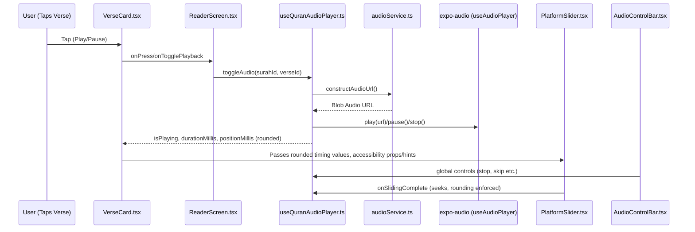

# Audio Playback Feature Logic & UI Implementation  
*Luminous Verses (Expo App)*

---

## Overview

The audio playback system enables users to listen to Quranic verses within a cross-platform React Native app. Designed for precision, accessibility, and stability, it leverages Expo's managed workflow with Vercel Blob for audio storage and `expo-audio` for playback, coordinating UI, custom hooks, defensive programming, and accessibility best practices.

---

## Architecture & Data Flow



---

## Main Components and Responsibilities

- **VerseCard.tsx**:  
  - Displays Quranic verse, translation, playback slider.
  - Handles tap-to-play/pause and state visuals.
  - Integrates ARIA accessibility roles and feedback.

- **PlatformSlider.tsx**:  
  - Cross-platform slider (native/web) for seeking.
  - Ensures all timing props and accessibility values are rounded integers.
  - Handles onChange/onSlidingComplete, passing events back to audio hook.

- **AudioControlBar.tsx**:  
  - Renders main playback controls (stop, skip, play/pause).
  - Consumes state and invokes control methods from the audio hook.

- **useQuranAudioPlayer.ts**:  
  - Custom hook wrapping `expo-audio`'s `useAudioPlayer`.
  - Controls instantiation, loading, playback, seeking, and teardown.
  - Returns live state and control functions to UI.
  - Enforces millisecond rounding for native safety and stability.

- **audioService.ts**:  
  - Constructs the correct blob URL for the given surah/verse.

---

## Deep Dive: Custom Hook Pattern (`useQuranAudioPlayer.ts`)

- Wraps `expo-audio` library hook, managing state: `isPlaying`, `isLoaded`, `positionMillis`, `durationMillis`, etc.
- Exposes:  
  - `toggleAudio(verse)`, `stopAudio()`, `seekAudio(ms)`, `setAutoplayEnabled(bool)`
- **Precision logic:**  
  - All ms-based props returned (or accepted) are `Math.round()`ed before passing to UI or underlying controls.
  - Defensive programming: if incoming values are potentially floats (e.g., from events or calculations), they are rounded again before use.
- Implements error logging if playback/precision errors are encountered (per `.clinerules` logging rule).

**Example:**  
```typescript
seekAudio = (positionMillis: number) => {
  const rounded = Math.round(positionMillis);
  // Use rounded for all downstream ops
  // ...
}
```

---

## UI Event Flow & Accessibility

### Event Sequence

1. **User taps VerseCard**  
   - If not active, triggers select and play.  
   - If active, toggles pause/play via `onTogglePlayback`.
2. **Slider (PlatformSlider) Interaction**  
   - Moving slider updates position UI in real time.
   - Releasing slider (onSlidingComplete) seeks to rounded ms pos in audio hook.
3. **AudioControlBar**  
   - Play/Pause/Stop/Skip controls interact with the hook for global actions.

### Accessibility Integration

- **VerseCard.tsx**  
  - `accessibilityRole="button"`
  - `accessibilityLabel` reflects verse and state (e.g., "Verse 2, paused")
  - Announcements via `AccessibilityInfo.announceForAccessibility`
- **PlatformSlider.tsx**  
  - Passes ARIA labels, hints, roles (`"adjustable"`), and rounded min/max/now values
  - Ensures values (e.g., slider thumb position) are integral for bridge/native safety
- **Haptics**  
  - Triggered on key interactions for tactile feedback.

---

## Codified & Unwritten Rules in Action

### From `.clinerules` to Code:

- **Always round ms values before passing to native-backed UI/props**  
  - Implemented in `useQuranAudioPlayer.ts` (hook), `PlatformSlider.tsx` (props/events), `VerseCard.tsx` (props, calculations)
- **Log and diagnose precision errors**  
  - Hooks/components log both raw and rounded values when precision mismatches are detected.
- **Defensive redundancy**  
  - Rounding occurs both at data source (hook) and UI boundary (component), following safety-in-depth.
- **Accessibility and ARIA compliance patterns**  
  - Each component explicitly manages ARIA properties (role, state, value, hint), announces state changes, and triggers haptic feedback for inclusivity.

---

## Best Practices & Lessons Learned

- Move all audio logic to a single, custom hook that encapsulates both the library and UI state for maintainability.
- Do rounding early and at every interface crossing to prevent subtle native bugs.
- Separate concerns: UI triggers intent; hook manages asynchronous state and lifecycle.
- Defensive programming catches both expected (e.g., event rounding) and unexpected (library or device edge cases) failures.
- Accessibility cannot be an afterthought—build it into event flows and validate with real devices and AT.
- Log all state transitions and errors, especially regarding value conversions and playback state.

---

## Future Guidance

- Extend this defensive, accessibility-first, and precision-obsessed approach to all new features.
- When refactoring, always re-read `.clinerules` and update it after discovering new bug classes or solutions.
- Require manual regression testing across all platforms after significant audio/UI/refactoring changes.
- Keep transporter functions and hooks as pure and side-effect free as possible.
- Documentation (like this report) and the memory bank are essential for onboarding and collaboration.

---

_End of report_  
*For further mapping of UI and feature specifics, reference [`docs/updated_audio_playback_refactoring_plan.md`](docs/updated_audio_playback_refactoring_plan.md) and [`memory-bank/.clinerules`](memory-bank/.clinerules) for live rule evolution.*