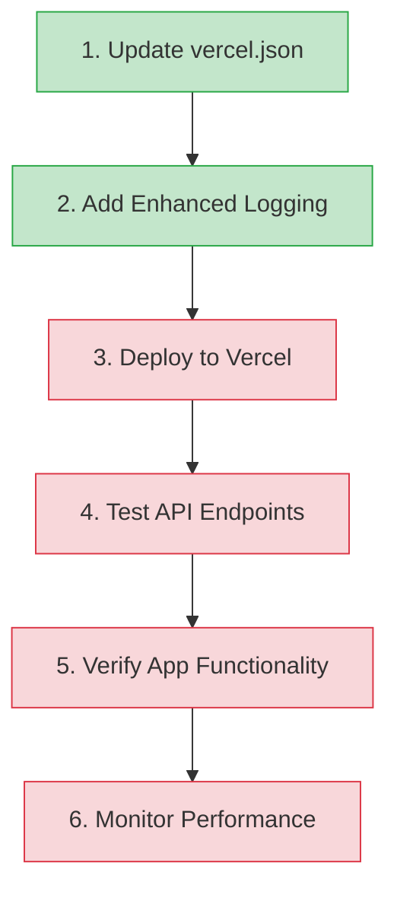

# API 404 Error Implementation Guide

This guide provides a clear roadmap for implementing the solution to the 404 error issue affecting the QuranExpo2 app's API endpoints.

## Summary of Findings

After analyzing the codebase, we've determined:

1. **Root Cause**: The Vercel API routing configuration in `vercel.json` doesn't properly map requests to the compiled JavaScript files.

2. **App Behavior**: 
   - Edge Config client fails to retrieve data
   - Local fallback data is not available
   - API fallback attempt fails with a 404 error
   - This prevents the app from displaying surah metadata

3. **Contributing Factors**:
   - When TypeScript files are compiled during Vercel deployment, they become `.js` files
   - The current routing configuration doesn't explicitly account for this transformation
   - The routing pattern needs to be updated to map requests like `/api/get-metadata` to `/api/get-metadata.js`

## Implementation Roadmap



**Note**: The green boxes indicate steps that can be implemented directly in architect mode, while red boxes require switching to code mode or manual implementation outside of architect mode.

## Step 1: Update vercel.json

The first and most critical step is to modify the `vercel.json` configuration file to explicitly handle API routes.

### Current Configuration:
```json
{
  "version": 2,
  "builds": [
    {
      "src": "api/**/*.ts",
      "use": "@vercel/node",
      "config": {
        "includeFiles": ["api/tsconfig.json"]
      }
    }
  ],
  "routes": [
    {
      "src": "/api/(.*)",
      "dest": "/api/$1"
    }
  ]
}
```

### Updated Configuration:
```json
{
  "version": 2,
  "builds": [
    {
      "src": "api/**/*.ts",
      "use": "@vercel/node",
      "config": {
        "includeFiles": ["api/tsconfig.json"]
      }
    }
  ],
  "routes": [
    {
      "src": "/api/([^/]+)",
      "dest": "/api/$1.js"
    }
  ]
}
```

This updated configuration specifically maps API requests like `/api/get-metadata` to `/api/get-metadata.js`, which is what Vercel produces during the build process from TypeScript files.

## Step 2: Add Enhanced Logging

Add more detailed logging to the API endpoints to help diagnose issues:

### Update to api/get-metadata.ts:

```javascript
module.exports = async function handler(req: typeof VercelRequest, res: typeof VercelResponse) {
  console.log(`[API] Request received: ${req.url}`);
  console.log(`[API] Query parameters: ${JSON.stringify(req.query)}`);
  console.log(`[API] Environment variables available: ${Object.keys(process.env).filter(key => !key.includes('KEY') && !key.includes('SECRET')).join(', ')}`);
  
  const { type } = req.query;
  let client;
  
  try {
    client = await pool.connect();
    console.log("[API] Successfully connected to database");
    
    // Handle different metadata requests
    if (type === 'surah-list') {
      console.log("[API] Executing surah-list query");
      const result = await client.query(
        'SELECT number, arabic_name AS name, transliteration AS tname, ' +
        'english_name AS ename, ayas, revelation_type AS type, chronological_order AS "order", rukus ' +
        'FROM quran_surahs ORDER BY number'
      );
      console.log(`[API] Query returned ${result.rows.length} rows`);
      return res.status(200).json(result.rows);
    }
    // Rest of the function...
  } catch (err: any) {
    console.error(`[API] Error fetching metadata (${type}):`, err);
    return res.status(500).json({ error: 'Database error', message: err.message });
  } finally {
    if (client) {
      console.log("[API] Releasing database connection");
      client.release();
    }
  }
}
```

### Apply Similar Logging to Other API Endpoints:

Add the same logging pattern to `api/get-verse.ts` and `api/get-verses.ts` to ensure consistent diagnostic information across all API endpoints.

## Step 3: Deploy to Vercel

After making the changes to `vercel.json` and adding enhanced logging:

1. Commit the changes to your repository
2. Push to your deployment branch
3. Vercel should automatically deploy the updated configuration
4. Monitor the deployment logs for any build errors

## Step 4: Test API Endpoints

After deployment, directly test the API endpoints to verify they're working correctly:

### Test the Surah List Endpoint:
```
https://onlyquranexpo.vercel.app/api/get-metadata?type=surah-list
```

### Test the Sajdas Endpoint:
```
https://onlyquranexpo.vercel.app/api/get-metadata?type=sajdas
```

### Test the Get Verse Endpoint:
```
https://onlyquranexpo.vercel.app/api/get-verse?surah=1&ayah=1
```

### Test the Get Verses Endpoint:
```
https://onlyquranexpo.vercel.app/api/get-verses?surah=1
```

## Step 5: Verify App Functionality

Once the API endpoints are confirmed to be working:

1. Open the app
2. Navigate to the surah list view
3. Verify that surahs are loading correctly
4. Check the app logs for any remaining errors

## Step 6: Monitor Performance

Implement ongoing monitoring to ensure continued operation:

1. Set up Vercel Function Monitoring:
   - Go to the Vercel dashboard
   - Navigate to your project
   - Check the "Functions" tab to monitor performance
   - Review logs for any errors or warnings

2. Implement Application-Level Monitoring:
   - Add periodic checks for API health
   - Log performance metrics

## Alternative Solution (If Needed)

If the updated routing configuration doesn't resolve the issue, implement this more explicit configuration:

```json
{
  "version": 2,
  "builds": [
    {
      "src": "api/**/*.ts",
      "use": "@vercel/node",
      "config": {
        "includeFiles": ["api/tsconfig.json"]
      }
    }
  ],
  "routes": [
    {
      "src": "/api/get-metadata",
      "dest": "/api/get-metadata.js"
    },
    {
      "src": "/api/get-verse",
      "dest": "/api/get-verse.js"
    },
    {
      "src": "/api/get-verses",
      "dest": "/api/get-verses.js"
    },
    {
      "src": "/api/(.*)",
      "dest": "/api/$1"
    }
  ]
}
```

This configuration explicitly handles each API endpoint individually.

## Database Connection Verification

If API routing changes don't resolve the issue, verify database connectivity:

1. Check Vercel Environment Variables:
   - Go to the Vercel dashboard
   - Navigate to your project settings
   - Go to the "Environment Variables" section
   - Verify `NEON_DATABASE_URL` is correctly set

2. Test Database Connection:
   - Add a simple test endpoint that only verifies database connectivity
   - Check for any connection errors in the logs

## Rollback Plan

If the changes cause new issues:

1. Revert to the previous `vercel.json` configuration
2. Remove the added logging
3. Deploy the reverted changes
4. Consider implementing a local fallback mechanism for critical data

## Next Steps

After implementing this solution:

1. Update the [memory-bank/activeContext.md](memory-bank/activeContext.md) to reflect the changes
2. Update the [memory-bank/progress.md](memory-bank/progress.md) to track the fixed issue
3. Consider implementing the longer-term improvements outlined in [memory-bank/api-debugging-monitoring-plan.md](memory-bank/api-debugging-monitoring-plan.md)