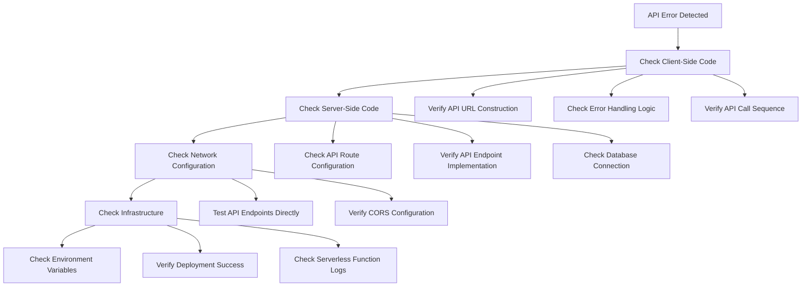
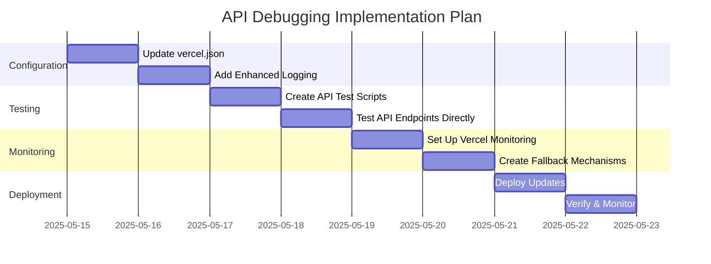

# API Debugging and Monitoring Plan

## Overview

This document outlines a systematic approach to debug and monitor API endpoints in the QuranExpo2 application, with specific focus on resolving the current 404 error issue on the `/api/get-metadata` endpoint.

## Diagnosis Framework

When experiencing API errors, follow this structured diagnostic approach:



## Enhanced API Logging Strategy

Implement comprehensive logging across all API endpoints to provide visibility into request processing:

### 1. Request Lifecycle Logging

Add structured logging for each stage of the request lifecycle:

```javascript
module.exports = async function handler(req: typeof VercelRequest, res: typeof VercelResponse) {
  const requestId = randomUUID(); // Or use a request ID if provided
  console.log(`[${requestId}] [API] Request received: ${req.method} ${req.url}`);
  console.log(`[${requestId}] [API] Query parameters: ${JSON.stringify(req.query)}`);
  console.log(`[${requestId}] [API] Headers: ${JSON.stringify(req.headers)}`);
  
  try {
    // Log database connection
    console.log(`[${requestId}] [API] Connecting to database...`);
    const client = await pool.connect();
    console.log(`[${requestId}] [API] Database connection established`);
    
    // Log query execution
    const { type } = req.query;
    console.log(`[${requestId}] [API] Executing query for type: ${type}`);
    
    // Process request based on type
    // ...
    
    console.log(`[${requestId}] [API] Query executed successfully, returning response`);
    return res.status(200).json(result);
  } catch (error) {
    console.error(`[${requestId}] [API] Error processing request:`, error);
    return res.status(500).json({ error: 'Server error', message: error.message });
  } finally {
    console.log(`[${requestId}] [API] Request completed`);
  }
}
```

### 2. Database Operation Logging

Add detailed logging for database operations:

```javascript
try {
  console.log(`[${requestId}] [API] Executing SQL query: ${query}`);
  const startTime = performance.now();
  const result = await client.query(query, params);
  const duration = performance.now() - startTime;
  console.log(`[${requestId}] [API] Query completed in ${duration.toFixed(2)}ms, returned ${result.rows.length} rows`);
  return result;
} catch (error) {
  console.error(`[${requestId}] [API] Database query failed after ${(performance.now() - startTime).toFixed(2)}ms:`, error);
  throw error;
}
```

### 3. Environmental Context Logging

Add logging to verify environment variables and configuration:

```javascript
// At API initialization
console.log('[API] API environment information:');
console.log(`[API] NODE_ENV: ${process.env.NODE_ENV}`);
console.log(`[API] Available environment variables: ${Object.keys(process.env).filter(key => !key.includes('KEY') && !key.includes('SECRET')).join(', ')}`);
console.log(`[API] Database connection string available: ${Boolean(process.env.NEON_DATABASE_URL)}`);
```

## API Testing Protocol

### 1. Direct API Endpoint Testing

Create a systematic approach to test all API endpoints directly:

| Endpoint | Test URL | Expected Result |
|----------|----------|----------------|
| Get Metadata (Surah List) | https://onlyquranexpo.vercel.app/api/get-metadata?type=surah-list | JSON array of surah info |
| Get Metadata (Sajdas) | https://onlyquranexpo.vercel.app/api/get-metadata?type=sajdas | JSON array of sajda verses |
| Get Verse | https://onlyquranexpo.vercel.app/api/get-verse?surah=1&ayah=1 | JSON object for Al-Fatiha verse 1 |
| Get Verses | https://onlyquranexpo.vercel.app/api/get-verses?surah=1 | JSON array of all Al-Fatiha verses |

### 2. API Endpoint Documentation

Document all API endpoints for easier debugging and maintenance:

```markdown
# QuranExpo2 API Documentation

## GET /api/get-metadata
Retrieves metadata for the Quran.

**Query Parameters:**
- `type` (required): Type of metadata to retrieve
  - `surah-list`: Returns list of all surahs with basic information
  - `sajdas`: Returns list of all sajda verses
  - `navigation-indices`: Returns navigation indices (not yet implemented)

**Example Response (surah-list):**
```json
[
  {
    "number": 1,
    "name": "الفاتحة",
    "tname": "Al-Fatiha",
    "ename": "The Opening",
    "ayas": 7,
    "type": "Meccan",
    "order": 5,
    "rukus": 1
  },
  // ...more surahs
]
```
```

### 3. Error Injection Testing

Create tests that deliberately inject errors to verify error handling:

- Test with invalid database credentials
- Test with missing query parameters
- Test with invalid query parameter values
- Test with database timing out

## Vercel Function Monitoring

### 1. Vercel Log Monitoring Strategy

Document how to effectively monitor logs in Vercel:

1. Go to the Vercel dashboard (https://vercel.com/dashboard)
2. Select the QuranExpo2 project
3. Navigate to "Deployments" and select the latest deployment
4. Go to the "Functions" tab to see all serverless functions
5. Click on a specific function (e.g., `api/get-metadata.js`) to view logs
6. Filter logs by:
   - Function name (e.g., "api/get-metadata")
   - Log level (e.g., "error")
   - Time range (e.g., last 24 hours)

### 2. Vercel Function Metrics Dashboard

Create a custom metrics dashboard in Vercel to monitor:

- Function invocations
- Function execution time
- Function error rate
- Function cold starts

## Local API Testing Environment

### 1. Local Testing with Vercel Dev

Set up a local testing environment using Vercel Dev:

```bash
# Install Vercel CLI
npm install -g vercel

# Login to Vercel
vercel login

# Pull environment variables
vercel env pull

# Start local development server
vercel dev
```

This allows testing API endpoints locally before deployment.

### 2. API Testing Script

Create a Node.js script to test all API endpoints:

```javascript
// scripts/test-api.js
const fetch = require('node-fetch');

const API_BASE_URL = process.env.API_BASE_URL || 'http://localhost:3000';

async function testEndpoint(endpoint, params = {}) {
  const queryString = Object.entries(params)
    .map(([key, value]) => `${key}=${value}`)
    .join('&');
    
  const url = `${API_BASE_URL}${endpoint}${queryString ? `?${queryString}` : ''}`;
  
  console.log(`Testing endpoint: ${url}`);
  
  try {
    const response = await fetch(url);
    const status = response.status;
    
    console.log(`Status: ${status}`);
    
    if (response.ok) {
      const data = await response.json();
      console.log(`Response: ${JSON.stringify(data).substring(0, 100)}...`);
    } else {
      const text = await response.text();
      console.error(`Error: ${text}`);
    }
  } catch (error) {
    console.error(`Fetch error: ${error.message}`);
  }
  
  console.log('---');
}

async function runTests() {
  await testEndpoint('/api/get-metadata', { type: 'surah-list' });
  await testEndpoint('/api/get-metadata', { type: 'sajdas' });
  await testEndpoint('/api/get-verse', { surah: 1, ayah: 1 });
  await testEndpoint('/api/get-verses', { surah: 1 });
}

runTests().catch(console.error);
```

## Fallback Mechanisms

### 1. Static Fallback Data

Create static JSON fallback data:

```javascript
// src/data/fallbacks/surah-list.json
// Export basic surah information as a fallback

// In quranMetadataService.ts, add static import fallback
import surahListFallback from '../data/fallbacks/surah-list.json';

// Modify getBasicSurahList function to use static fallback as last resort
export async function getBasicSurahList(): Promise<SurahBasicInfo[] | null> {
  // ... existing Edge Config and API fetch logic ...
  
  // If all other methods fail, use static fallback
  console.warn('All fetch methods failed, using static fallback data');
  return surahListFallback as SurahBasicInfo[];
}
```

### 2. Edge Config Initialization Script

Create a script to initialize Edge Config with essential data:

```javascript
// scripts/init-edge-config.js
// This script populates Edge Config with basic data from static files
// Run after deployment to ensure Edge Config is populated
```

## Implementation Plan

Follow this step-by-step plan to implement the enhanced debugging and monitoring:



## Success Criteria

The API debugging and monitoring plan will be considered successful when:

1. All API endpoints return the expected data with proper status codes
2. Comprehensive logging is in place for all request processing stages
3. Fallback mechanisms work correctly when primary data sources fail
4. Vercel function monitoring is configured to alert on unusual patterns
5. API documentation is complete and accurate
6. A local testing environment is established for future development