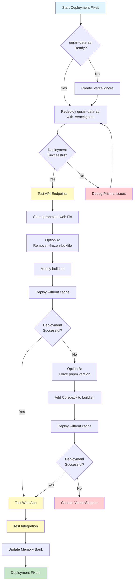

# Deployment Fixes Visual Summary

## 🚀 Deployment Fix Flow



## 📋 Quick Reference Commands

### 1. Test quran-data-api after deployment:
```bash
# Replace with your actual API domain
curl https://your-quran-data-api.vercel.app/api/v1/health
curl https://your-quran-data-api.vercel.app/api/v1/surahs
```

### 2. Commit for Option A (quranexpo-web):
```bash
git add apps/quranexpo-web/build.sh
git commit -m "fix: remove --frozen-lockfile flag from quranexpo-web build"
git push origin main
```

### 3. Commit for Option B (if needed):
```bash
git add apps/quranexpo-web/build.sh
git commit -m "fix: add Corepack to ensure pnpm version in build.sh"
git push origin main
```

## 🎯 Success Indicators

### ✅ quran-data-api Success:
- No Prisma file conflict errors in logs
- Deployment status shows "Ready"
- API endpoints return valid JSON responses

### ✅ quranexpo-web Success:
- No pnpm lockfile errors in logs
- Astro build completes successfully
- Web app loads in browser
- Can fetch data from API

## ⚠️ Common Issues & Solutions

### Issue: API still shows Prisma conflicts
**Solution:** Check if `.vercelignore` is in the correct location and properly formatted

### Issue: Web build still fails with lockfile error
**Solution:** Ensure you selected "Deploy without cache" in Vercel dashboard

### Issue: Web app can't connect to API
**Solution:** Check CORS settings and API URL configuration

## 📊 Deployment Timeline



```mermaid
gantt
    title Deployment Fix Timeline
    dateFormat HH:mm
    section quran-data-api
    Redeploy with .vercelignore    :api1, 00:00, 10m
    Monitor logs                    :api2, after api1, 5m
    Test endpoints                  :api3, after api2, 5m
    
    section quranexpo-web
    Apply Option A                  :web1, after api3, 5m
    Commit and push                 :web2, after web1, 2m
    Deploy without cache            :web3, after web2, 10m
    Monitor logs                    :web4, after web3, 5m
    Test application                :web5, after web4, 5m
    
    section Integration
    Test full integration           :int1, after web5, 10m
    Update documentation            :int2, after int1, 10m
```

Total estimated time: ~60 minutes (if no issues arise)