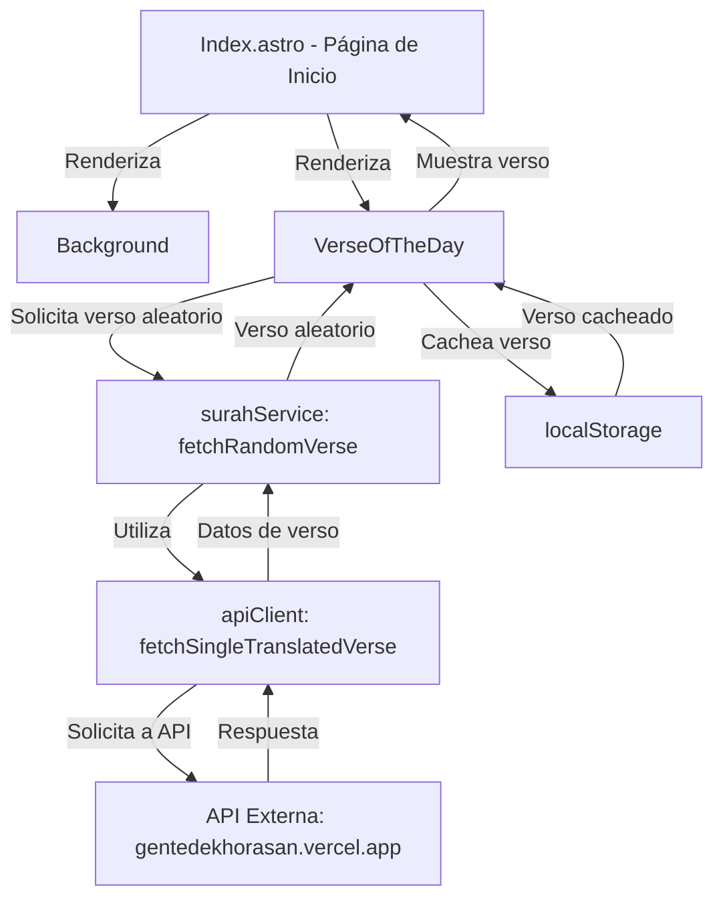

# Informe de Análisis de la Página de Inicio de QuranExpo

## Resumen
Este informe detalla el análisis de la página de inicio de la aplicación QuranExpo, ubicada en `apps/quranexpo-web/src/pages/index.astro`. Se exploran los componentes de UI utilizados, su lógica y las interacciones de datos asociadas.

## Estructura de la Página de Inicio
La página de inicio (`index.astro`) es una página Astro que sirve como punto de entrada principal para la aplicación. Su estructura es la siguiente:

- **Encabezado y Estilos**: Incluye metadatos básicos, un favicon y estilos globales importados desde `../styles/global.css`.
- **Componentes Principales**:
  - `Background`: Un componente de fondo (probablemente visual o decorativo) importado desde `../components/Background.tsx`.
  - `VerseOfTheDay`: Un componente que muestra un verso del día, importado desde `../components/VerseOfTheDay.tsx`, cargado con la directiva `client:visible` para renderizado del lado del cliente solo cuando es visible.
- **Elementos de Navegación**:
  - Un enlace a la página de marcadores (`/bookmarks`) con un icono de marcador (`BookmarkIcon`).
  - Un botón de navegación a la lista de surahs (`/surahs`) etiquetado como "Abrir Corán".
- **Diseño**: Utiliza un diseño centrado con animaciones para la secuencia de aparición de elementos (`animate-sequence-1`, `animate-sequence-2`, `animate-sequence-3`).

## Componentes de UI

### 1. Background
- **Archivo**: `../components/Background.tsx`
- **Propósito**: No se ha leído el contenido específico de este componente, pero su nombre sugiere que proporciona un fondo visual para la página de inicio, posiblemente un gradiente o una imagen.

### 2. VerseOfTheDay
- **Archivo**: `../components/VerseOfTheDay.tsx`
- **Propósito**: Muestra un verso aleatorio del Corán como "Verso del Día".
- **Lógica**:
  - Utiliza `useState` y `useEffect` de Preact para manejar el estado de carga, error y datos del verso.
  - Obtiene un verso aleatorio mediante la función `fetchRandomVerse` del servicio `surahService`.
  - Implementa un sistema de caché en `localStorage` para almacenar el verso del día y evitar solicitudes repetidas al API, con una verificación de fecha para actualizar el verso diariamente (desactivado en modo de desarrollo).
  - Incluye funcionalidad de compartir el verso mediante `navigator.share` (si está disponible) o copiando al portapapeles como fallback.
- **Estilo**: Utiliza un contenedor con efecto de "glassmorphism" (vidrio esmerilado) para un diseño visual atractivo, con animaciones de carga y manejo de errores.

## Lógica de Datos y Servicios

### 1. apiClient.ts
- **Archivo**: `../services/apiClient.ts`
- **Propósito**: Proporciona funciones para interactuar con la API externa de QuranExpo (`https://gentedekhorasan.vercel.app/api/v1`) para obtener datos como listas de surahs, versos, traducciones y descripciones.
- **Funciones Relevantes para la Página de Inicio**:
  - `fetchSurahList()`: Obtiene la lista completa de surahs.
  - `fetchSingleTranslatedVerse()`: Obtiene un verso específico con su traducción, utilizado indirectamente a través de `fetchRandomVerse` en `surahService`.
- **Manejo de Errores**: Implementa un manejo robusto de errores con mensajes específicos para diferentes códigos de estado HTTP y estructuras de datos inválidas.

### 2. surahService (No leído pero referenciado)
- **Propósito**: Aunque no se ha leído directamente, se infiere que `surahService.ts` contiene la función `fetchRandomVerse()` que utiliza las funciones de `apiClient.ts` para seleccionar un verso aleatorio, probablemente utilizado por `VerseOfTheDay`.

## Flujo de Datos
- La página de inicio no interactúa directamente con la API, pero el componente `VerseOfTheDay` obtiene un verso aleatorio a través de `fetchRandomVerse` de `surahService`, que a su vez utiliza funciones de `apiClient.ts` para hacer solicitudes a la API externa.
- Los datos del verso se almacenan en caché en `localStorage` para mejorar el rendimiento y reducir las solicitudes al servidor.

## Diagrama de Componentes y Flujo de Datos

## Observaciones y Recomendaciones
- **Optimización de Caché**: La implementación de caché en `VerseOfTheDay` es eficiente para reducir solicitudes al API, pero está desactivada en modo de desarrollo, lo cual es una buena práctica para pruebas.
- **Compatibilidad de Navegadores**: La funcionalidad de compartir en `VerseOfTheDay` utiliza `navigator.share`, con un fallback adecuado para navegadores que no lo soportan.
- **Diseño Responsivo**: La página de inicio utiliza clases de Tailwind CSS para un diseño responsivo (`sm:text-4xl`), lo que asegura una buena experiencia en diferentes dispositivos.
- **Mejora Potencial**: Considerar la precarga de datos de verso en el servidor Astro si es posible, para mejorar el tiempo de carga inicial y reducir la dependencia de JavaScript del lado del cliente.

## Conclusión
La página de inicio de QuranExpo es una interfaz simple pero efectiva que presenta un verso destacado del día y proporciona navegación a otras secciones de la aplicación. Utiliza componentes de Preact para interactividad y obtiene datos de una API externa, con un sistema de caché para optimizar el rendimiento.