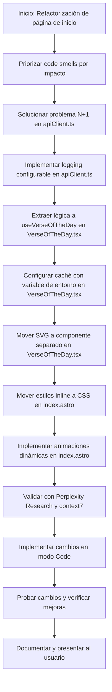

# Plan Detallado para Refactorización de la Página de Inicio de QuranExpo

## Objetivo
Desarrollar un plan detallado para refactorizar la página de inicio de QuranExpo, abordando los "code smells" identificados y priorizando las soluciones según su impacto en la mantenibilidad y el rendimiento del código.

## Priorización de "Code Smells"
Los "code smells" identificados en la página de inicio de QuranExpo se priorizan de la siguiente manera, basándose en su impacto en el rendimiento y la mantenibilidad:

1. **Problema N+1 en apiClient.ts**: Este problema tiene un impacto significativo en el rendimiento debido a las múltiples consultas innecesarias a la API. Es la prioridad más alta.
2. **Lógica compleja en useEffect en VerseOfTheDay.tsx**: La lógica compleja dentro de useEffect dificulta el mantenimiento y el testeo del código, por lo que es la segunda prioridad.
3. **Estilos inline en index.astro**: Los estilos inline afectan la escalabilidad y el rendimiento, por lo que se abordan en tercer lugar.
4. **Falta de logging configurable en apiClient.ts**: La ausencia de logging configurable puede dificultar el diagnóstico de problemas en producción, pero tiene un impacto menor en comparación con los otros problemas.

## Plan de Refactorización

### 1. Solucionar el Problema N+1 en apiClient.ts
**Estrategia**: Implementar técnicas de batching y prefetching para reducir las consultas a la API. Diseñar endpoints optimizados que devuelvan información relacionada en una sola respuesta.

**Pasos de Implementación**:
- Modificar las funciones de obtención de datos en `apiClient.ts` para agrupar las consultas y obtener todos los datos necesarios en una sola llamada.
- Implementar caché para evitar consultas repetitivas, utilizando una estrategia de caché con tiempo de vida configurable.
- Actualizar los endpoints de la API para devolver datos relacionados en una sola respuesta, si es posible.

**Fundamentación**: Según la investigación de `Perplexity Research`, el uso de batching y prefetching reduce la latencia y el tráfico de red, mejorando el rendimiento general de la aplicación [1].

**Ejemplo de Código**:
```javascript
// Ejemplo de batching en apiClient.ts
async function fetchMultipleVerses(verseIds) {
  const cachedData = getCachedData(verseIds);
  if (cachedData) return cachedData;

  const response = await fetch(`/api/verses?ids=${verseIds.join(',')}`);
  const data = await response.json();
  cacheData(verseIds, data);
  return data;
}
```

### 2. Extraer Lógica Compleja de useEffect en VerseOfTheDay.tsx
**Estrategia**: Dividir la lógica compleja en hooks personalizados reutilizables para mejorar la legibilidad y el testeo del código.

**Pasos de Implementación**:
- Crear un hook personalizado `useVerseOfTheDay` que encapsule la lógica de obtención y actualización del verso del día.
- Utilizar múltiples `useEffect` para separar las responsabilidades, como la obtención de datos y la gestión de eventos.
- Extraer cualquier manipulación de datos compleja a funciones auxiliares fuera del cuerpo de `useEffect`.

**Fundamentación**: La documentación de Preact obtenida de `context7` destaca la importancia de los hooks personalizados para la reutilización de lógica estatal entre componentes independientes [2]. Además, `Perplexity Research` sugiere que descomponer la lógica en hooks reutilizables facilita el mantenimiento y el testeo [1].

**Ejemplo de Código**:
```jsx
// Hook personalizado en VerseOfTheDay.tsx
function useVerseOfTheDay() {
  const [verse, setVerse] = useState(null);
  
  useEffect(() => {
    async function fetchVerse() {
      const data = await fetchVerseOfTheDay();
      setVerse(data);
    }
    fetchVerse();
  }, []);
  
  return { verse };
}

function VerseOfTheDay() {
  const { verse } = useVerseOfTheDay();
  return <div>{verse ? verse.text : 'Cargando...'}</div>;
}
```

### 3. Mover Estilos Inline a Archivos CSS en index.astro
**Estrategia**: Reemplazar los estilos inline por estilos definidos en archivos CSS externos o módulos CSS para mejorar la mantenibilidad y el rendimiento.

**Pasos de Implementación**:
- Crear un archivo CSS externo `styles/home.css` para definir los estilos de la página de inicio.
- Importar el archivo CSS en `index.astro` utilizando la sintaxis de importación ESM.
- Eliminar todos los estilos inline y reemplazarlos con clases CSS definidas en el archivo externo.

**Fundamentación**: La documentación de Astro de `context7` muestra cómo importar hojas de estilo locales en componentes Astro para optimizar y empaquetar los estilos automáticamente [3]. `Perplexity Research` también indica que los estilos inline dificultan el mantenimiento y reducen el rendimiento al impedir la optimización y el caching eficiente de CSS [1].

**Ejemplo de Código**:
```astro
---
// En index.astro
import '../styles/home.css';
---
<div class="hero-section">
  <h1>Bienvenido a QuranExpo</h1>
</div>
```

```css
/* En styles/home.css */
.hero-section {
  background-color: #f0f0f0;
  padding: 2rem;
}

.hero-section h1 {
  color: #333;
  font-size: 2.5rem;
}
```

### 4. Implementar Logging Configurable en apiClient.ts
**Estrategia**: Añadir un sistema de logging con niveles configurables para facilitar el diagnóstico de problemas en producción sin exponer información sensible.

**Pasos de Implementación**:
- Implementar un sistema de logging que diferencie niveles como info, warning, error y debug.
- Configurar filtros por entorno para reducir los logs verbosos en producción.
- Asegurarse de no exponer información sensible en los logs.

**Fundamentación**: Según `Perplexity Research`, un logging deficiente puede dificultar el diagnóstico de errores y problemas de rendimiento en producción. Diferenciar niveles de logging y usar filtros por entorno son prácticas recomendadas [1].

**Ejemplo de Código**:
```javascript
// En apiClient.ts
const LOG_LEVELS = {
  DEBUG: 0,
  INFO: 1,
  WARNING: 2,
  ERROR: 3
};

const CURRENT_LEVEL = process.env.LOG_LEVEL || 'INFO';

function log(level, message) {
  if (LOG_LEVELS[level] >= LOG_LEVELS[CURRENT_LEVEL]) {
    console.log(`[${level}] ${message}`);
  }
}

async function fetchVerseOfTheDay() {
  log('DEBUG', 'Iniciando obtención del verso del día');
  try {
    const response = await fetch('/api/verse-of-the-day');
    if (!response.ok) {
      log('ERROR', `Error al obtener el verso del día: ${response.status}`);
      throw new Error('Error al obtener el verso del día');
    }
    const data = await response.json();
    log('INFO', 'Verso del día obtenido con éxito');
    return data;
  } catch (error) {
    log('ERROR', `Error en fetchVerseOfTheDay: ${error.message}`);
    throw error;
  }
}
```

## Diagrama del Flujo del Plan de Refactorización


## Referencias
1. Investigación de `Perplexity Research` sobre mejores prácticas para abordar "code smells" en aplicaciones web.
2. Documentación de Preact de `context7` sobre la creación de hooks personalizados.
3. Documentación de Astro de `context7` sobre mejores prácticas de estilo en Astro.