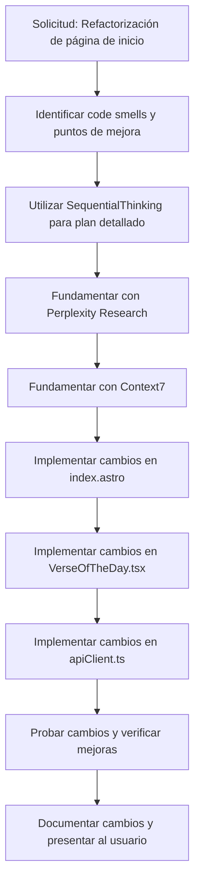

# Plan para Refactorización de la Página de Inicio de QuranExpo

## Objetivo
Identificar "code smells" y puntos potenciales para refactorización dentro de la página de inicio de QuranExpo y sus componentes asociados, y construir un plan detallado para implementar estos cambios, fundamentado con investigaciones adicionales.

## Análisis de "Code Smells" y Puntos de Refactorización

### 1. index.astro
- **Code Smell: Uso de Estilos Inline**
  - **Problema**: La página utiliza estilos inline (`style="padding-bottom: env(safe-area-inset-bottom, 0px); padding-top: env(safe-area-inset-top, 20px);"`), lo que reduce la mantenibilidad y la capacidad de reutilización de los estilos.
  - **Solución Propuesta**: Mover estos estilos a una clase CSS en el archivo de estilos globales o a un archivo CSS específico para la página de inicio.
- **Code Smell: Animaciones Secuenciales Hardcoded**
  - **Problema**: Las animaciones (`animate-sequence-1`, `animate-sequence-2`, `animate-sequence-3`) están hardcoded en las clases, lo que puede dificultar la personalización o reutilización.
  - **Solución Propuesta**: Considerar un enfoque más dinámico para las animaciones, como un componente o una utilidad que maneje las secuencias de animación.

### 2. VerseOfTheDay.tsx
- **Code Smell: Lógica Compleja en useEffect**
  - **Problema**: El `useEffect` para obtener el verso del día contiene lógica compleja para el manejo de caché y errores, lo que hace que el componente sea difícil de leer y mantener.
  - **Solución Propuesta**: Extraer la lógica de caché y obtención de datos a un hook personalizado (`useVerseOfTheDay`) para mejorar la legibilidad y reutilización.
- **Code Smell: Manejo de Errores y Caché Desactivado en Desarrollo**
  - **Problema**: Aunque es una buena práctica para pruebas, la desactivación del caché en modo de desarrollo está hardcoded, lo que podría llevar a errores si se olvida reactivarlo en producción.
  - **Solución Propuesta**: Usar una variable de entorno o una configuración para controlar la desactivación del caché en desarrollo.
- **Code Smell: Inline SVG para Icono de Compartir**
  - **Problema**: El SVG para el icono de compartir está definido inline en el componente, lo que reduce la reutilización y aumenta el tamaño del componente.
  - **Solución Propuesta**: Mover el SVG a un componente de icono separado o a una carpeta de iconos para reutilización.

### 3. apiClient.ts
- **Code Smell: Problema de Consulta N+1 en fetchVersesForSurah**
  - **Problema**: Se identifica explícitamente un problema de consulta N+1 al obtener traducciones para cada verso individualmente, lo que es ineficiente.
  - **Solución Propuesta**: Modificar la API backend para soportar la obtención de todas las traducciones de una surah en una sola solicitud, o implementar un mecanismo de caché para las traducciones.
- **Code Smell: Logs de Depuración Hardcoded**
  - **Problema**: Hay logs de depuración extensos hardcoded en funciones como `addBookmark`, lo que puede generar ruido en la consola en producción.
  - **Solución Propuesta**: Usar un sistema de logging configurable que se pueda desactivar en producción o mover los logs de depuración a un modo de desarrollo.

## Plan Detallado para Refactorización

### Paso 1: Utilizar SequentialThinking para Planificación
- Utilizar el servidor MCP `sequentialthinking` para desarrollar un plan paso a paso para abordar cada "code smell" identificado. Esto incluirá:
  - Priorizar las refactorizaciones según su impacto en el rendimiento y la mantenibilidad.
  - Definir pasos específicos para cada cambio, como la creación de nuevos componentes, hooks o modificaciones en la API.

### Paso 2: Fundamentar con Perplexity Research
- Utilizar el servidor MCP `Perplexity Research` para investigar las mejores prácticas en:
  - Manejo de estilos en aplicaciones Astro (para abordar estilos inline).
  - Optimización de rendimiento en aplicaciones web con datos dinámicos (para el problema N+1).
  - Estrategias de logging en aplicaciones de producción.

### Paso 3: Fundamentar con Context7
- Utilizar el servidor MCP `context7` para obtener documentación específica sobre:
  - Bibliotecas o frameworks relevantes como Astro y Preact para validar las soluciones propuestas.
  - Ejemplos de implementación de hooks personalizados en Preact para `useVerseOfTheDay`.

### Paso 4: Implementación de Cambios
- **index.astro**:
  - Mover estilos inline a una clase CSS.
  - Implementar un enfoque dinámico para animaciones.
- **VerseOfTheDay.tsx**:
  - Extraer lógica de datos a un hook personalizado `useVerseOfTheDay`.
  - Mover el SVG del icono de compartir a un componente separado.
  - Configurar el manejo de caché con una variable de entorno.
- **apiClient.ts**:
  - Proponer cambios en la API backend para resolver el problema N+1.
  - Implementar un sistema de logging configurable.

## Diagrama de Flujo del Plan de Refactorización

## Siguientes Pasos
- Proceder a utilizar el servidor MCP `sequentialthinking` para desarrollar un plan detallado de implementación.
- Realizar investigaciones con `Perplexity Research` y `context7` para fundamentar las soluciones propuestas.
- Una vez que el plan esté completo y fundamentado, cambiar al modo `Code` para implementar los cambios en el código.