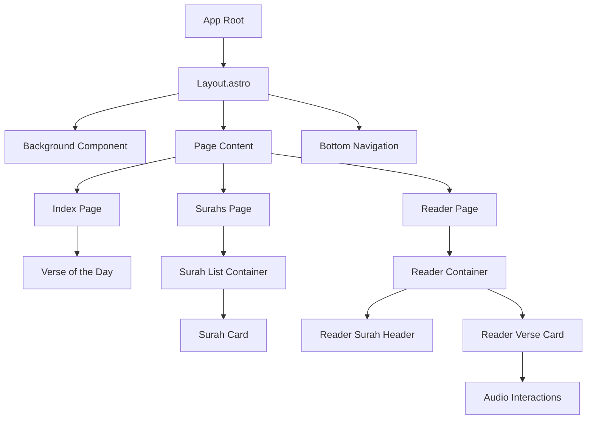

# System Patterns: Quran Expo Web App

## System Architecture

The Quran Expo Web App follows a modern, component-based architecture built on Astro with Preact integration. Key architectural aspects include:

```mermaid
graph TD
    A[Client Browser] --> B[Astro Server/Static Files]
    B --> C[Preact Components]
    C --> D[API Client (quranexpo-web)]
    D --> E_MONOREPO[quran-api-data (Vercel API: https://gentedekhorasan.vercel.app/api/v1)]
    E_MONOREPO --> F[Underlying Quran DB/Source]
    E_MONOREPO --> G[Audio Files Source]
```

### Core Architecture Decisions

1. **Astro as the Framework**:
   - Provides static site generation with dynamic islands of interactivity
   - Enables excellent performance through minimal client-side JavaScript
   - Supports file-based routing for simple navigation patterns

2. **Preact for Interactive Components**:
   - Lightweight alternative to React
   - Used for components requiring client-side interactivity (e.g., audio playback)
   - Integrated into Astro pages using the `client:visible` or `client:load` directives

3. **TailwindCSS for Styling**:
   - Utility-first approach for consistent styling
   - Custom theme variables that mirror the native app's color scheme
   - Responsive design patterns for cross-device compatibility

4. **API-First Data Fetching**:
   - All Quranic content retrieved from the `quran-api-data` project within the monorepo, deployed as a Vercel API.
   - This API serves data similarly to the native app's sources, ensuring content consistency.
   - Client-side API service patterns are used for data fetching.

## Component Hierarchy and Relationships



## Key Design Patterns

### 1. Container/Presentational Pattern
- **Container Components**: Handle data fetching, state management, and business logic
  - Example: `ReaderContainer.tsx` manages verse data and audio state
- **Presentational Components**: Focus on rendering UI based on props
  - Example: `ReaderVerseCard.tsx` displays verse content and responds to interactions

### 2. Custom Hook Pattern
- Custom hooks encapsulate complex logic, especially for stateful features
- Example: `useVersePlayer.ts` manages all audio playback logic and state

### 3. Global State Management (Nanostores)
- `nanostores` is used for lightweight, framework-agnostic global state management.
- `persistentAtom` from `@nanostores/persistent` is used for state that needs to persist across sessions (e.g., user settings, bookmarks).
- Examples: `settingsStore.ts`, `bookmarkStore.ts`

### 3. Service Pattern
- API interactions are abstracted into service modules
- Example: `apiClient.ts` provides methods for fetching Quran data

### 5. Prop Drilling Pattern
- State and callbacks are passed down through component hierarchies
- Used when global state is not necessary and component hierarchies are relatively shallow

### 6. Responsive Design Pattern
- Mobile-first approach with breakpoints for larger screens
- TailwindCSS utilities for consistent responsive behavior

## Data Flow Patterns

### API Data Flow
1. Container components call API client methods
2. API client makes HTTP requests to external endpoints 
3. Response data is transformed to match internal data models
4. Transformed data is stored in component state
5. Data is passed to child components via props

### User Interaction Flow
1. User interacts with presentational components (e.g., taps a verse)
2. Event handlers in presentational components call callbacks from props
3. Container component handles the event, updates state
4. State changes trigger re-renders with new props to presentational components
5. UI updates to reflect the new state

### Audio Playback Flow
1. User taps on a verse
2. Container component calls `toggleVerseAudio` from `useVersePlayer` hook
3. Hook manages audio element creation, event binding, and state updates
4. State changes propagate back to the container component
5. Container passes updated state to verse component
6. Verse component shows appropriate visual feedback based on audio state

### Bookmark Management Flow
1. User long-presses on a `ReaderVerseCard`.
2. `ReaderVerseCard` calls `addBookmark` or `removeBookmark` from `bookmarkStore.ts`.
3. `bookmarkStore` updates its `persistentAtom` and `localStorage`.
4. Components subscribed to `bookmarkStore` (e.g., `BookmarkListContainer`) react to changes and update their UI.
5. On the `bookmarks.astro` page, `BookmarkListContainer` fetches and displays all saved bookmarks, allowing users to view verse text, notes, and creation date, and navigate to the verse or edit/delete the bookmark.

## Technical Standards

1. **TypeScript** for type safety across the application
2. **ESLint** for code quality and consistency
3. **CSS Custom Properties** for theming variables
4. **CSS Modules** or scoped styles for component-specific styling
5. **Semantic HTML** for accessibility and SEO benefits