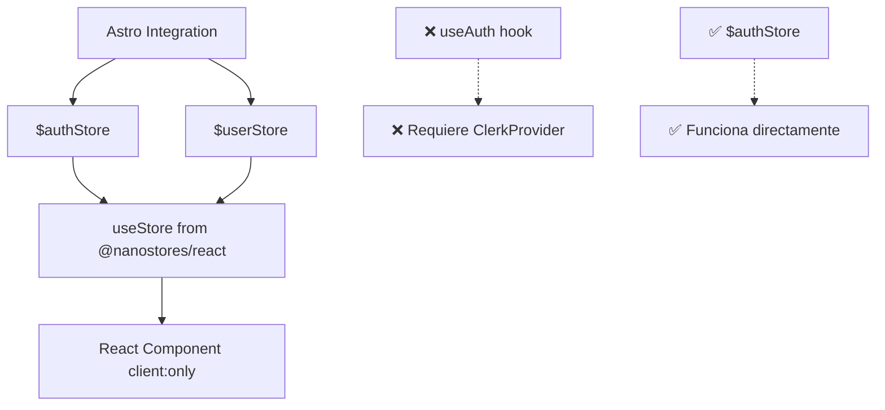

# Plan de Corrección: Error ClerkProvider con Clerk Stores

## 🚨 Problema Actual

**Error:** `@clerk/clerk-react: useAuth can only be used within the <ClerkProvider /> component`

**Causa Raíz:** Estamos usando `useAuth()` de `@clerk/clerk-react` en un componente `client:only="react"`, pero este hook requiere un `ClerkProvider` que no está disponible. En Astro, debemos usar **Clerk stores** en lugar de hooks de React.

## 🎯 Solución: Usar Clerk Stores

### Diferencia Clave
- ❌ **Hooks de React:** `useAuth()` de `@clerk/clerk-react` (requiere ClerkProvider)
- ✅ **Stores de Astro:** `$authStore`, `$userStore` de `@clerk/astro/client` (funcionan directamente)

### Arquitectura Correcta



## 📋 Plan de Implementación

### Paso 1: Actualizar Hook de Migración (5 minutos)

**Archivo:** `apps/quranexpo-web/src/hooks/useAuthAndBookmarkMigration.ts`

**Cambio:** Reemplazar `useAuth()` con `$authStore`

```typescript
// ANTES (❌ Causa error)
import { useAuth } from '@clerk/clerk-react';

export function useAuthAndBookmarkMigration() {
  const { userId, isLoaded, isSignedIn } = useAuth();
  // ...
}
```

```typescript
// DESPUÉS (✅ Funciona correctamente)
import { useStore } from '@nanostores/react';
import { $authStore, $userStore } from '@clerk/astro/client';
import { useEffect, useRef, useState } from 'preact/hooks';
import { migrateBookmarksToDatabase } from '../services/bookmarkMigrationService';

export function useAuthAndBookmarkMigration() {
  const auth = useStore($authStore);
  const user = useStore($userStore);
  const hasMigrated = useRef(false);
  const [migrationStatus, setMigrationStatus] = useState<'idle' | 'migrating' | 'success' | 'error'>('idle');

  useEffect(() => {
    // auth.userId es undefined (loading), null (signed out), o string (signed in)
    if (auth.userId === undefined) return; // Still loading
    
    if (auth.userId && user && !hasMigrated.current) {
      setMigrationStatus('migrating');
      console.log('User is signed in, attempting bookmark migration...');
      
      migrateBookmarksToDatabase(auth.userId)
        .then(() => {
          hasMigrated.current = true;
          setMigrationStatus('success');
          console.log('Bookmark migration completed successfully.');
        })
        .catch(error => {
          setMigrationStatus('error');
          console.error('Error during bookmark migration:', error);
        });
    } else if (auth.userId === null) {
      // User signed out
      hasMigrated.current = false;
      setMigrationStatus('idle');
      console.log('User signed out, resetting migration status.');
    }
  }, [auth.userId, user]);

  return { 
    migrationStatus,
    isSignedIn: auth.userId !== null && auth.userId !== undefined,
    userId: auth.userId,
    user
  };
}
```

### Paso 2: Instalar Dependencia (1 minuto)

```bash
cd apps/quranexpo-web
npm install @nanostores/react
```

### Paso 3: Actualizar AuthClientWrapper (2 minutos)

**Archivo:** `apps/quranexpo-web/src/components/AuthClientWrapper.tsx`

```tsx
import { useAuthAndBookmarkMigration } from '../hooks/useAuthAndBookmarkMigration';

interface AuthClientWrapperProps {
  children: preact.ComponentChildren;
}

export default function AuthClientWrapper({ children }: AuthClientWrapperProps) {
  const { migrationStatus, isSignedIn } = useAuthAndBookmarkMigration();
  
  return (
    <>
      {/* Indicador de migración opcional */}
      {migrationStatus === 'migrating' && (
        <div className="fixed top-4 right-4 bg-blue-500 text-white px-4 py-2 rounded-lg shadow-lg z-50">
          Sincronizando bookmarks...
        </div>
      )}
      {migrationStatus === 'error' && (
        <div className="fixed top-4 right-4 bg-red-500 text-white px-4 py-2 rounded-lg shadow-lg z-50">
          Error al sincronizar bookmarks
        </div>
      )}
      {children}
    </>
  );
}
```

### Paso 4: Verificar Layout.astro (Ya está correcto)

**Archivo:** `apps/quranexpo-web/src/layouts/Layout.astro`

```astro
---
import AuthClientWrapper from '../components/AuthClientWrapper.tsx';
import Background from '../components/Background.tsx';
import '../styles/global.css';

interface Props {
  title: string;
}

const { title } = Astro.props;
---

<!doctype html>
<html lang="en">
  <head>
    <meta charset="UTF-8" />
    <meta name="viewport" content="width=device-width" />
    <link rel="icon" type="image/svg+xml" href="/favicon.svg" />
    <meta name="generator" content={Astro.generator} />
    <title>{title}</title>
  </head>
  <body>
    <Background />
    <!-- ✅ Esto está correcto -->
    <AuthClientWrapper client:only="react">
      <slot />
    </AuthClientWrapper>
  </body>
</html>
```

## 🔍 Comparación: Hooks vs Stores

### Hooks de React (❌ No funciona en Astro)
```typescript
import { useAuth } from '@clerk/clerk-react';

function Component() {
  const { userId, isLoaded, isSignedIn } = useAuth(); // ❌ Error: ClerkProvider required
  // ...
}
```

### Stores de Astro (✅ Funciona correctamente)
```typescript
import { useStore } from '@nanostores/react';
import { $authStore } from '@clerk/astro/client';

function Component() {
  const auth = useStore($authStore); // ✅ Funciona sin provider
  const { userId } = auth;
  // userId: undefined (loading) | null (signed out) | string (signed in)
}
```

## 🧪 Testing del Fix

### Test 1: Verificar que no hay errores de ClerkProvider
```bash
cd apps/quranexpo-web
npm run dev
# Abrir http://localhost:4321/settings
# Verificar que no hay errores en consola
```

### Test 2: Verificar migración funciona
1. Abrir DevTools → Console
2. Hacer login con Clerk
3. Verificar logs: "User is signed in, attempting bookmark migration..."
4. Verificar que no hay errores

### Test 3: Verificar estados de autenticación
```typescript
// En cualquier componente React client:only
import { useStore } from '@nanostores/react';
import { $authStore } from '@clerk/astro/client';

function TestComponent() {
  const auth = useStore($authStore);
  
  console.log('Auth state:', {
    userId: auth.userId,
    isLoading: auth.userId === undefined,
    isSignedOut: auth.userId === null,
    isSignedIn: typeof auth.userId === 'string'
  });
  
  return <div>Check console for auth state</div>;
}
```

## 📊 Estados de los Stores

### $authStore
```typescript
{
  userId: undefined | null | string
  // undefined = loading
  // null = signed out  
  // string = signed in (user ID)
}
```

### $userStore
```typescript
{
  // undefined = loading
  // null = signed out
  // User object = signed in
}
```

## 🔧 Comandos de Implementación

```bash
# 1. Instalar dependencia
cd apps/quranexpo-web
npm install @nanostores/react

# 2. Actualizar hook (editar manualmente)
# apps/quranexpo-web/src/hooks/useAuthAndBookmarkMigration.ts

# 3. Probar la aplicación
npm run dev

# 4. Verificar en navegador
# http://localhost:4321/settings
```

## 🚀 Ventajas de la Solución

### ✅ Beneficios
- **Sin ClerkProvider:** Los stores funcionan directamente con la integración de Astro
- **SSR Compatible:** Los stores manejan correctamente el estado durante hidratación
- **Mejor Performance:** Menos overhead que los hooks de React
- **Más Simple:** No necesita configuración adicional de providers

### 🔄 Migración Automática
- **Mantiene funcionalidad:** La migración de bookmarks sigue funcionando
- **Mejor UX:** Indicadores de estado durante la migración
- **Error Handling:** Manejo robusto de errores

## 📝 Archivos Modificados

1. **`useAuthAndBookmarkMigration.ts`** - Cambiar de `useAuth()` a `$authStore`
2. **`AuthClientWrapper.tsx`** - Añadir indicadores de migración
3. **`package.json`** - Añadir `@nanostores/react`

## 🔗 Referencias

- [Clerk Astro Stores Documentation](https://clerk.com/docs/references/astro)
- [Nanostores React Integration](https://github.com/nanostores/nanostores#react)
- [Astro Client Directives](https://docs.astro.build/en/reference/directives-reference/#client-directives)

## ⚡ Implementación Rápida (10 minutos)

1. **Instalar dependencia:** `npm install @nanostores/react`
2. **Actualizar hook:** Reemplazar `useAuth()` con `$authStore`
3. **Probar:** `npm run dev` y verificar `/settings`
4. **Confirmar:** No más errores de ClerkProvider

Esta solución resuelve definitivamente el problema de ClerkProvider y mantiene toda la funcionalidad de migración de bookmarks.