# Plan de Implementación: Arreglar Logout No Funcional

## 🚨 Problema Identificado

**Síntoma:** El botón de logout no hace nada cuando se hace clic

**Causa Raíz:** Los componentes de Clerk para Astro (`SignOutButton`, `SignedIn`, `SignedOut`) están diseñados para SSR, pero se están usando con `client:load`, lo que causa que no funcionen correctamente durante la hidratación.

**Ubicación del Problema:**
- `apps/quranexpo-web/src/components/AuthSection.astro` (usa `SignOutButton` de `@clerk/astro/components`)
- `apps/quranexpo-web/src/pages/settings.astro` (carga `AuthSection` con `client:load`)

## 🎯 Solución: Crear Componente React con Clerk Stores

### Arquitectura de la Solución

```mermaid
flowchart TD
    A[settings.astro] --> B[AuthSectionReact.tsx client:only]
    B --> C[$clerkStore.signOut]
    B --> D[$authStore para estado]
    B --> E[$userStore para datos]
    
    F[❌ AuthSection.astro client:load] -.-> G[❌ No funciona]
    H[✅ AuthSectionReact.tsx client:only] -.-> I[✅ Funciona correctamente]
```



## 📋 Plan de Implementación

### Paso 1: Crear Componente React de Autenticación (10 minutos)

**Archivo:** `apps/quranexpo-web/src/components/AuthSectionReact.tsx`

```tsx
import { useStore } from '@nanostores/react';
import { $authStore, $userStore, $clerkStore } from '@clerk/astro/client';

interface AuthSectionReactProps {
  // Props si necesitas pasar alguna configuración
}

export default function AuthSectionReact({}: AuthSectionReactProps) {
  const auth = useStore($authStore);
  const user = useStore($userStore);
  const clerk = useStore($clerkStore);

  const handleSignOut = async () => {
    try {
      await clerk.signOut();
      console.log('User signed out successfully');
    } catch (error) {
      console.error('Error signing out:', error);
    }
  };

  const handleSignIn = () => {
    clerk.openSignIn();
  };

  const handleSignUp = () => {
    clerk.openSignUp();
  };

  // Loading state
  if (auth.userId === undefined || user === undefined) {
    return (
      <div className="bg-glassmorphism-strong backdrop-blur-md rounded-xl p-6 border border-white/20">
        <h2 className="text-xl font-semibold text-textPrimary mb-4">Account</h2>
        <div className="flex items-center justify-center py-8">
          <div className="animate-spin rounded-full h-8 w-8 border-b-2 border-desertHighlightGold"></div>
        </div>
      </div>
    );
  }

  // Signed out state
  if (auth.userId === null || user === null) {
    return (
      <div className="bg-glassmorphism-strong backdrop-blur-md rounded-xl p-6 border border-white/20">
        <h2 className="text-xl font-semibold text-textPrimary mb-4">Account</h2>
        
        <div className="space-y-3">
          <button 
            onClick={handleSignIn}
            className="w-full bg-desertHighlightGold hover:bg-desertHighlightGold/80 text-white font-medium py-2 px-4 rounded-lg transition-colors flex items-center justify-center space-x-2"
          >
            <svg className="w-5 h-5" fill="currentColor" viewBox="0 0 20 20">
              <path fillRule="evenodd" d="M3 3a1 1 0 011 1v12a1 1 0 11-2 0V4a1 1 0 011-1zm7.707 3.293a1 1 0 010 1.414L9.414 9H17a1 1 0 110 2H9.414l1.293 1.293a1 1 0 01-1.414 1.414l-3-3a1 1 0 010-1.414l3-3a1 1 0 011.414 0z" clipRule="evenodd"></path>
            </svg>
            <span>Sign In</span>
          </button>
          
          <button 
            onClick={handleSignUp}
            className="w-full bg-skyDeepBlue hover:bg-skyDeepBlue/80 text-white font-medium py-2 px-4 rounded-lg transition-colors flex items-center justify-center space-x-2"
          >
            <svg className="w-5 h-5" fill="currentColor" viewBox="0 0 20 20">
              <path fillRule="evenodd" d="M10 9a3 3 0 100-6 3 3 0 000 6zm-7 9a7 7 0 1114 0H3z" clipRule="evenodd"></path>
            </svg>
            <span>Sign Up</span>
          </button>
        </div>
      </div>
    );
  }

  // Signed in state
  return (
    <div className="bg-glassmorphism-strong backdrop-blur-md rounded-xl p-6 border border-white/20">
      <h2 className="text-xl font-semibold text-textPrimary mb-4">Account</h2>
      
      <div className="flex items-center justify-between">
        <div className="flex items-center space-x-3">
          {/* Avatar simple */}
          <div className="w-10 h-10 rounded-full bg-desertHighlightGold flex items-center justify-center text-white font-semibold">
            {user.firstName?.[0] || user.emailAddresses?.[0]?.emailAddress?.[0] || 'U'}
          </div>
          <div>
            <span className="text-textPrimary font-medium">
              {user.firstName ? `Welcome back, ${user.firstName}!` : 'Welcome back!'}
            </span>
            {user.emailAddresses?.[0] && (
              <p className="text-sm text-textSecondary">
                {user.emailAddresses[0].emailAddress}
              </p>
            )}
          </div>
        </div>
        
        <button 
          onClick={handleSignOut}
          className="bg-red-600 hover:bg-red-700 text-white font-medium py-2 px-4 rounded-lg transition-colors flex items-center justify-center space-x-2"
        >
          <svg className="w-5 h-5" fill="currentColor" viewBox="0 0 20 20">
            <path fillRule="evenodd" d="M3 3a1 1 0 011 1v12a1 1 0 11-2 0V4a1 1 0 011-1zm7.707 3.293a1 1 0 010 1.414L9.414 9H17a1 1 0 110 2H9.414l1.293 1.293a1 1 0 01-1.414 1.414l-3-3a1 1 0 010-1.414l3-3a1 1 0 011.414 0z" clipRule="evenodd"></path>
          </svg>
          <span>Sign Out</span>
        </button>
      </div>
    </div>
  );
}
```

### Paso 2: Actualizar settings.astro (2 minutos)

**Archivo:** `apps/quranexpo-web/src/pages/settings.astro`

```astro
---
// ANTES
// import AuthSection from '../components/AuthSection.astro';

// DESPUÉS
import AuthSectionReact from '../components/AuthSectionReact.tsx';
import BackButton from '../components/BackButton.tsx';
import Layout from '../layouts/Layout.astro';
---

<Layout title="Settings - QuranExpo">
  <div class="min-h-screen bg-gradient-to-br from-desertSand via-skyLightBlue to-desertSand p-4">
    <div class="max-w-md mx-auto space-y-6">
      <!-- Back Button -->
      <BackButton client:load />

      <!-- Account Section -->
      <!-- ANTES: <AuthSection client:load /> -->
      <!-- DESPUÉS: -->
      <AuthSectionReact client:only="react" />

      <!-- Settings sections remain the same -->
      <!-- ... resto del contenido ... -->
    </div>
  </div>
</Layout>
```

### Paso 3: Verificar Dependencias (1 minuto)

Asegurarse de que `@nanostores/react` esté instalado:

```bash
cd apps/quranexpo-web
npm list @nanostores/react
# Si no está instalado:
# npm install @nanostores/react
```

### Paso 4: Opcional - Mantener AuthSection.astro para SSR (2 minutos)

Si quieres usar `AuthSection.astro` en otras páginas con SSR, puedes mantenerlo y crear una versión específica para client-side.

**Renombrar archivo:**
```bash
# Opcional: renombrar para claridad
mv apps/quranexpo-web/src/components/AuthSection.astro apps/quranexpo-web/src/components/AuthSectionSSR.astro
```

## 🧪 Testing del Fix

### Test 1: Verificar que el logout funciona
```bash
cd apps/quranexpo-web
npm run dev
# Abrir http://localhost:4321/settings
# 1. Hacer login
# 2. Hacer clic en "Sign Out"
# 3. Verificar que el usuario se desloguea
```

### Test 2: Verificar estados de autenticación
1. **Estado Loading:** Verificar que aparece el spinner
2. **Estado Signed Out:** Verificar botones de Sign In/Sign Up
3. **Estado Signed In:** Verificar información del usuario y botón Sign Out

### Test 3: Verificar funcionalidad completa
1. **Sign In:** Hacer clic en "Sign In" → Modal de Clerk se abre
2. **Sign Up:** Hacer clic en "Sign Up" → Modal de Clerk se abre  
3. **Sign Out:** Hacer clic en "Sign Out" → Usuario se desloguea
4. **Navegación:** Verificar que funciona en diferentes páginas

## 🔍 Comparación: Componentes SSR vs React

### Componentes de Astro SSR (❌ No funciona con client:load)
```astro
---
import { SignOutButton } from '@clerk/astro/components'
---
<!-- ❌ No funciona correctamente con client:load -->
<SignOutButton asChild>
  <button>Sign Out</button>
</SignOutButton>
```

### Componente React con Stores (✅ Funciona correctamente)
```tsx
import { useStore } from '@nanostores/react';
import { $clerkStore } from '@clerk/astro/client';

function SignOutButton() {
  const clerk = useStore($clerkStore);
  
  const handleSignOut = () => {
    clerk.signOut(); // ✅ Funciona perfectamente
  };
  
  return <button onClick={handleSignOut}>Sign Out</button>;
}
```

## 📊 Estados de los Stores

### $authStore
```typescript
{
  userId: undefined | null | string
  // undefined = loading
  // null = signed out  
  // string = signed in (user ID)
}
```

### $userStore
```typescript
{
  // undefined = loading
  // null = signed out
  // User object = signed in
  firstName?: string
  emailAddresses?: Array<{emailAddress: string}>
  // ... otros campos del usuario
}
```

### $clerkStore
```typescript
{
  signOut: () => Promise<void>
  openSignIn: () => void
  openSignUp: () => void
  // ... otros métodos de Clerk
}
```

## 🔧 Comandos de Implementación

```bash
# 1. Crear el nuevo componente React
touch apps/quranexpo-web/src/components/AuthSectionReact.tsx

# 2. Actualizar settings.astro (editar manualmente)

# 3. Verificar dependencias
cd apps/quranexpo-web
npm list @nanostores/react

# 4. Probar la aplicación
npm run dev

# 5. Verificar en navegador
# http://localhost:4321/settings
```

## 🚀 Ventajas de la Solución

### ✅ Beneficios
- **Logout Funcional:** El botón de logout ahora funciona correctamente
- **Estados Claros:** Loading, signed out, signed in manejados apropiadamente
- **Mejor UX:** Información del usuario visible, estados de carga
- **Consistente:** Usa el mismo patrón que la migración de bookmarks
- **Mantenible:** Código React estándar, fácil de debuggear

### 🔄 Funcionalidades
- **Sign In/Sign Up:** Modales de Clerk funcionan correctamente
- **Sign Out:** Logout funciona inmediatamente
- **Estado del Usuario:** Muestra nombre y email del usuario
- **Loading States:** Indicadores de carga apropiados

## 📝 Archivos Modificados

1. **`AuthSectionReact.tsx`** - Nuevo componente React con Clerk stores
2. **`settings.astro`** - Cambiar de `AuthSection` a `AuthSectionReact`
3. **`package.json`** - Verificar `@nanostores/react` (ya debería estar)

## 🔗 Referencias

- [Clerk $clerkStore Documentation](https://clerk.com/docs/references/astro/clerk-store)
- [Clerk signOut Method](https://clerk.com/docs/references/javascript/clerk#sign-out)
- [Nanostores React Integration](https://github.com/nanostores/nanostores#react)

## ⚡ Implementación Rápida (15 minutos)

1. **Crear componente:** `AuthSectionReact.tsx` con código completo
2. **Actualizar página:** Cambiar import en `settings.astro`
3. **Probar:** `npm run dev` y verificar logout funciona
4. **Confirmar:** Todos los estados de autenticación funcionan

Esta solución resuelve definitivamente el problema del logout no funcional y proporciona una experiencia de usuario completa y consistente.