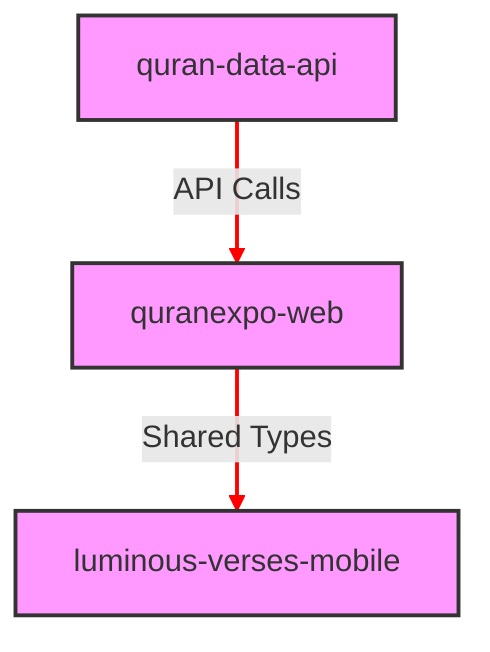

# Active Context: Gente de Khorasan Monorepo

**Version:** 1.0.0
**Date:** 2025-05-25
**Related Brief:** `memory-bank/projectbrief.md`
**Related Progress:** `memory-bank/progress.md`

## 1. Current Focus & State

-   **Focus:**
    1.  Resolución de problemas críticos de deployment en Vercel para `quran-data-api` y `quranexpo-web`.
    2.  Verificación de la integración y funcionalidad de los subproyectos dentro del monorepo.
    3.  Preparación para el desarrollo continuo de nuevas características y mejoras.
-   **State:**
    -   **Monorepo Structure:** Establecida con `apps/luminous-verses-mobile`, `apps/quran-data-api`, `apps/quranexpo-web`, y `packages/quran-types`.
    -   **`apps/quran-data-api` (API Serverless):**
        -   **Estado:** ❌ **Deployment fallando** debido a conflictos de archivos Prisma.
        -   **Funcionalidad:** Sirve datos del Corán (texto, traducciones, metadatos) desde Neon PostgreSQL y Vercel Edge Config.
        -   **Problemas Resueltos Recientemente:** Errores de compilación de TypeScript, problemas de generación de Prisma Client, y errores de enrutamiento `404` en Vercel (antes del nuevo error).
    -   **`apps/quranexpo-web` (Aplicación Web):**
        -   **Estado:** ❌ **Deployment fallando** debido a problemas de configuración de TurboRepo.
    -   **`apps/luminous-verses-mobile` (Aplicación Móvil):**
        -   **Estado:** El proyecto móvil se construye localmente sin errores.
        -   **Dirección del Proyecto:** Nativo-only (iOS y Android).
    -   **`packages/quran-types` (Tipos Compartidos):**
        -   **Estado:** Definiciones de tipos compartidas disponibles para todos los subproyectos.
    -   **Memory Bank (Nivel Raíz):** Actualizada para reflejar el contexto y el progreso del monorepo.

## 2. Recent Changes / Milestones (2025-05-25)

-   **Completada la Etapa 1: Fixes Críticos del Plan de Reorganización del Monorepo:**
    -   **`apps/luminous-verses-expo` renombrado a `apps/luminous-verses-mobile`:** Se actualizó el nombre del paquete y los scripts en `package.json`.
    -   **Corrección de `apps/luminous-verses-mobile`:** Se eliminaron las dependencias y el código de Next.js (`next/dynamic`, `next/head`) de `app/(tabs)/index.tsx`, `app/(tabs)/reader.tsx`, `app/(tabs)/surahs.tsx`, y `app/_layout.tsx`. Se corrigió la ruta de la imagen en `src/components/ScreenBackground.tsx`.
    -   **Actualización de `turbo.json` (raíz):** Se definieron tareas de build específicas (`build:web`, `build:api`, `build:mobile`) y se ajustaron los `outputs`.
    -   **Actualización de `package.json` (raíz):** Se crearon scripts para invocar los builds específicos de TurboRepo (`build:web`, `build:api`, `build:mobile`).
    -   **Builds Locales Exitosos:** Todos los proyectos (`quran-data-api`, `quranexpo-web`, `luminous-verses-mobile`) ahora se construyen localmente sin errores.

## 3. Problemas Críticos de Deployment (Activos)

### 3.1. `quran-data-api` (Prioridad: URGENTE - Bloqueador Principal)
-   **Error:** `Two or more files have conflicting paths or names` (conflicto entre `query_engine_bg.js` y `query_engine_bg.wasm`).
-   **Causa Raíz:** Prisma genera archivos con el mismo nombre base pero diferentes extensiones, lo que Vercel interpreta como un conflicto.
-   **Solución Implementada:** Se creó el archivo `apps/quran-data-api/.vercelignore` con el siguiente contenido para excluir los archivos problemáticos:
    ```
    # Ignore Prisma WASM and native binaries that conflict with Vercel deployment
    api/generated/prisma/*.wasm
    api/generated/prisma/libquery_engine-*.node
    api/generated/prisma/*.dylib.node
    api/generated/prisma/*.so.node
    ```
-   **Estado:** ✅ **FIX IMPLEMENTADO.** Pendiente de re-deployment en Vercel para verificación.

### 3.2. `quranexpo-web` (Prioridad: ALTA - Bloqueador Secundario)
-   **Error:** Vercel no encuentra el directorio de salida (`No Output Directory named "dist" found`).
-   **Causa Raíz DEFINITIVA:** **Vercel auto-detecta TurboRepo** y ejecuta `turbo build` global en lugar del build específico de `quranexpo-web`:
    -   Log muestra: `> Detected Turbo. Adjusting default settings...`
    -   Ejecuta: `turbo build` con scope: `luminous-verses-mobile`, `quran-data-api`, `quran-types`
    -   **NO incluye `@quran-monorepo/quranexpo-web` en el scope**
    -   Ignora configuración manual del proyecto
-   **Solución DEFINITIVA:**
    -   **Crear `.vercelignore` en `apps/quranexpo-web/`** para deshabilitar auto-detección de TurboRepo
    -   **Cambiar Framework a 'Astro'** en Vercel Dashboard
    -   **Output Directory: 'dist'**
-   **Estado:** ✅ **CAUSA RAÍZ CONFIRMADA.** Solución documentada en `memory-bank/quranexpo-web-vercel-turbo-solution.md`. Requiere Code mode para implementar.

## 4. Dependencias de Arquitectura (Actualmente Afectadas)

-   La falla en `quran-data-api` impacta directamente a `quranexpo-web`.
-   `luminous-verses-mobile` depende de `quran-data-api` para datos, por lo que también está afectado indirectamente.

## 5. Plan de Acción Inmediato
1.  **PRIORIDAD 1:** Re-desplegar `quran-data-api` en Vercel para verificar que el archivo `.vercelignore` resuelve el conflicto de Prisma.
2.  **PRIORIDAD 2:** Re-desplegar `quranexpo-web` en Vercel con la configuración de `Build Command` y `ignoreCommand` actualizada.
3.  **PRIORIDAD 3:** Verificar la funcionalidad completa de `quranexpo-web` y `luminous-verses-mobile` una vez que `quran-data-api` esté operativo.

## 6. Soluciones Técnicas Listas para Pruebas
-   **`quran-data-api`:** Archivo `apps/quran-data-api/.vercelignore` creado.
-   **`quranexpo-web`:** Comando de build de TurboRepo y `ignoreCommand` en `vercel.json` corregidos.

## 7. Próximos Pasos (Después de la Resolución de Deployment)
-   **Optimización de la Integración de TurboRepo:** Explorar más a fondo las capacidades de TurboRepo para optimizar los builds y el caching entre proyectos.
-   **Estrategia de Versionado del Monorepo:** Definir una estrategia clara para el versionado de los paquetes y aplicaciones dentro del monorepo.
-   **CI/CD para el Monorepo:** Configurar pipelines de CI/CD que manejen los builds y despliegues de los diferentes proyectos del monorepo de manera eficiente.
-   **Pruebas de Rendimiento:** Realizar pruebas de rendimiento exhaustivas en la API y las aplicaciones.