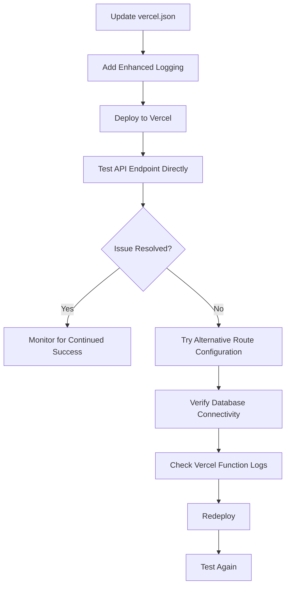

# API 404 Error Comprehensive Solution

## Problem Summary

The QuranExpo2 app is encountering 404 errors when trying to fetch surah metadata. The error message shows:
> "Edge Config client not available or data not found, and no local fallback. Attempting API fetch for getBasicSurahList."

This indicates that:
1. Edge Config is not available/working
2. There's no local fallback data
3. The API fallback attempt is failing with a 404 error

## Root Cause Analysis

After investigating the code and configuration files, we've identified the following potential causes:

### 1. Vercel API Routing Configuration Issue

The most likely cause is that the current routing configuration in `vercel.json` doesn't properly map API requests to the compiled JavaScript files:

```json
"routes": [
  {
    "src": "/api/(.*)",
    "dest": "/api/$1"
  }
]
```

When TypeScript files like `api/get-metadata.ts` are compiled during Vercel deployment, they become `.js` files (e.g., `api/get-metadata.js`). The current routing doesn't explicitly direct requests to these `.js` files, which is likely causing the 404 errors.

### 2. API Implementation is Correct

The API implementation in `get-metadata.ts` is using the correct CommonJS syntax and properly querying the database. There are no syntax issues in the API endpoint code itself.

### 3. Client-Side Implementation is Properly Falling Back

The client-side implementation in `quranMetadataService.ts` correctly tries multiple fallback mechanisms:
1. First, it tries to fetch from Edge Config
2. If that fails, it checks for local fallback data
3. Finally, it attempts to fetch from the API, which is where it's encountering the 404 error

### 4. API_BASE_URL is Properly Configured

The `API_BASE_URL` in `app.json` is set to "https://onlyquranexpo.vercel.app", which matches the expected Vercel deployment URL.

## Solution Plan

### 1. Update Vercel.json Route Configuration

The most important fix is to update the `vercel.json` file with a more explicit routing configuration that handles the compiled JavaScript files:

```json
{
  "version": 2,
  "builds": [
    {
      "src": "api/**/*.ts",
      "use": "@vercel/node",
      "config": {
        "includeFiles": ["api/tsconfig.json"]
      }
    }
  ],
  "routes": [
    {
      "src": "/api/([^/]+)",
      "dest": "/api/$1.js"
    }
  ]
}
```

This configuration specifically maps API requests like `/api/get-metadata` to `/api/get-metadata.js`, which is the compiled output that Vercel actually serves.

### 2. Add Enhanced Logging

Add more detailed logging to `api/get-metadata.ts` to help diagnose any remaining issues:

```javascript
module.exports = async function handler(req: typeof VercelRequest, res: typeof VercelResponse) {
  console.log(`[API] Request received: ${req.url}`);
  console.log(`[API] Query parameters: ${JSON.stringify(req.query)}`);
  console.log(`[API] Environment variables available: ${Object.keys(process.env).join(', ')}`);
  
  const { type } = req.query;
  // Rest of the function...
}
```

Also add more detailed logging to database operations:

```javascript
try {
  client = await pool.connect();
  console.log("[API] Successfully connected to database");
  
  // Handle different metadata requests
  if (type === 'surah-list') {
    console.log("[API] Executing surah-list query");
    const result = await client.query(
      'SELECT number, arabic_name AS name, transliteration AS tname, ' +
      'english_name AS ename, ayas, revelation_type AS type, chronological_order AS "order", rukus ' +
      'FROM quran_surahs ORDER BY number'
    );
    console.log(`[API] Query returned ${result.rows.length} rows`);
    return res.status(200).json(result.rows);
  }
  // Rest of the function...
}
```

### 3. Verify Database Connectivity

Ensure that the `NEON_DATABASE_URL` environment variable is correctly set in the Vercel deployment:

1. Go to the Vercel dashboard
2. Navigate to your project
3. Go to Settings > Environment Variables
4. Verify that `NEON_DATABASE_URL` is set to the correct connection string
5. If needed, update the connection string and redeploy

### 4. Test API Endpoint Directly

After implementing these changes, test the API endpoint directly by visiting:
```
https://onlyquranexpo.vercel.app/api/get-metadata?type=surah-list
```

### 5. Alternative Approach (if needed)

If the updated routing configuration doesn't resolve the issue, consider using an even more explicit configuration that handles each endpoint individually:

```json
{
  "version": 2,
  "builds": [
    {
      "src": "api/**/*.ts",
      "use": "@vercel/node",
      "config": {
        "includeFiles": ["api/tsconfig.json"]
      }
    }
  ],
  "routes": [
    {
      "src": "/api/get-metadata",
      "dest": "/api/get-metadata.js"
    },
    {
      "src": "/api/get-verse",
      "dest": "/api/get-verse.js"
    },
    {
      "src": "/api/get-verses",
      "dest": "/api/get-verses.js"
    },
    {
      "src": "/api/(.*)",
      "dest": "/api/$1"
    }
  ]
}
```

## Implementation Strategy



## Expected Outcome

After implementing these changes, we expect:

1. API requests will properly route to the compiled JavaScript files
2. The `/api/get-metadata?type=surah-list` endpoint will successfully return the list of surahs
3. The app will display the surah list properly on the surah page
4. We'll see detailed logs in the Vercel console that can help diagnose any remaining issues

## Monitoring Plan

After implementing the changes:

1. Monitor the Vercel deployment logs for any errors or warnings
2. Check the app's performance to ensure it's loading the surah list correctly
3. Verify that the Edge Config fallback mechanism is working as expected
4. Consider adding more robust error handling to improve the user experience if API issues occur