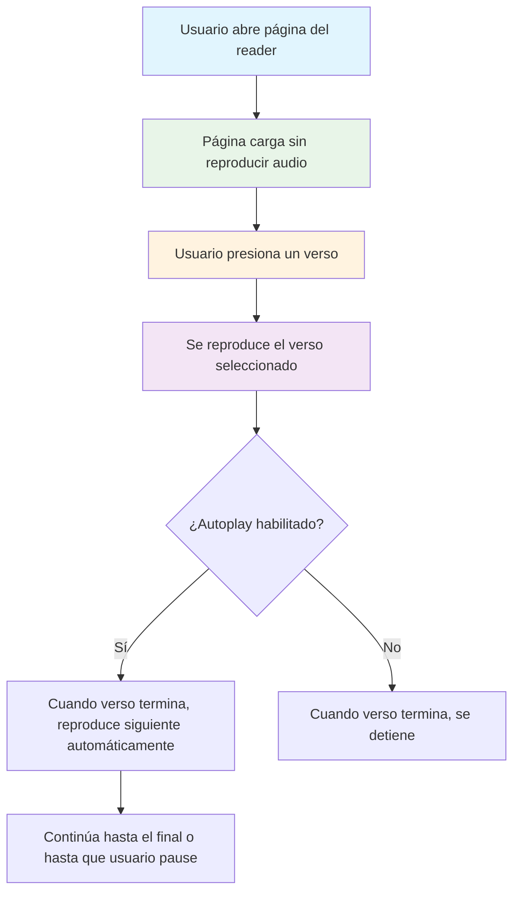

# Corrección: Autoplay Iniciando Inmediatamente al Cargar Página

## 🚨 Problema Identificado

**Comportamiento Actual (Incorrecto)**: Cuando autoplay está habilitado, el audio comienza automáticamente al abrir la página del reader, reproduciendo el primer verso sin interacción del usuario.

**Comportamiento Esperado**: El autoplay solo debe activarse DESPUÉS de que el usuario haya presionado un verso para iniciar la reproducción.

## 🔍 Análisis Técnico

### Causa Raíz

En `ReaderContainer.tsx`, líneas **101-105**:

```typescript
// Autoplay the first verse if autoplay is enabled
if ($autoplayEnabled && versesData.length > 0) {
  console.log('Autoplay enabled, playing first verse.');
  playVerse(versesData[0].surahId, versesData[0].numberInSurah);
}
```

**Problema**: Esta lógica reproduce automáticamente el primer verso al cargar los datos, sin esperar interacción del usuario.

### Lógica Correcta Existente

En `useVersePlayer.ts`, líneas **314-349**, ya existe la lógica correcta de autoplay que funciona cuando un verso termina:

```typescript
const handleEnded = () => {
  console.log(`[Audio#${id}] Event: ended. Audio finalizado, comprobando estado de autoplay.`);
  dispatch({ type: 'ENDED' });

  if ($autoplayEnabled && verses && currentVerseIndex !== null) {
    console.log(`[Audio#${id}] Condición de autoplay CUMPLIDA. Intentando reproducir siguiente verso.`);
    const nextIndex = currentVerseIndex + 1;
    
    if (nextIndex < verses.length) {
      const nextVerse = verses[nextIndex];
      console.log(`[Audio#${id}] Reproduciendo siguiente verso:`, nextVerse.surahId, nextVerse.numberInSurah);
      if (playVerseRef.current) {
        playVerseRef.current(nextVerse.surahId, nextVerse.numberInSurah);
      }
    } else {
      console.log(`[Audio#${id}] Alcanzado el final de los versos, deteniendo la reproducción.`);
      if (stopAndUnloadCompletelyRef.current) {
        stopAndUnloadCompletelyRef.current();
      }
      setAudioActive(false);
    }
  }
};
```

**Esta lógica es correcta** y debe mantenerse.

## 🎯 Flujo de Usuario Correcto



## 🚀 Solución

### Cambio Requerido

**Remover completamente** las líneas 101-105 de `ReaderContainer.tsx`:

```typescript
// ❌ REMOVER ESTAS LÍNEAS
// Autoplay the first verse if autoplay is enabled
if ($autoplayEnabled && versesData.length > 0) {
  console.log('Autoplay enabled, playing first verse.');
  playVerse(versesData[0].surahId, versesData[0].numberInSurah);
}
```

### Código Actualizado

El `useEffect` en `ReaderContainer.tsx` debe quedar así:

```typescript
useEffect(() => {
  const loadData = async () => {
    setLoading(true);
    setError(null);
    setSurah(null);
    setVerses([]);
    
    // Stop any playing audio when changing Surahs
    stopAndUnload();

    try {
      // Fetch Surah details and verses in parallel
      const [surahData, versesData] = await Promise.all([
        fetchSurahById(surahId),
        fetchVersesForSurah(surahId)
      ]);

      if (!surahData) {
        throw new Error(`Surah with ID ${surahId} not found.`);
      }

      setSurah(surahData);
      setVerses(versesData);
      console.log('Loading data for Surah:', surahId);
      console.log('Verses after fetch:', versesData.length);

      // ✅ NO reproducir automáticamente - esperar interacción del usuario
      
    } catch (err: any) {
      console.error('Error loading Surah data:', err);
      setError(err.message || 'Failed to load Surah data. Please try again.');
    } finally {
      setLoading(false);
    }
  };

  if (surahId > 0 && surahId <= 114) {
    loadData();
  } else {
    setError('Invalid Surah ID. Please enter a number between 1 and 114.');
    setLoading(false);
  }
}, [surahId]);
```

## ✅ Verificación de la Solución

### Comportamiento Esperado Post-Corrección:

1. **Al cargar página**: No se reproduce audio automáticamente
2. **Al presionar verso**: Se reproduce el verso seleccionado
3. **Con autoplay habilitado**: Cuando el verso termina, reproduce automáticamente el siguiente
4. **Con autoplay deshabilitado**: Cuando el verso termina, se detiene

### Checklist de Pruebas:

- [ ] Abrir página del reader con autoplay habilitado
- [ ] Verificar que NO se reproduce audio automáticamente
- [ ] Presionar un verso y verificar que se reproduce
- [ ] Con autoplay habilitado, verificar que continúa al siguiente verso automáticamente
- [ ] Desactivar autoplay y verificar que se detiene al terminar el verso
- [ ] Verificar que los logs no muestran "Autoplay enabled, playing first verse" al cargar

## 🔧 Implementación

### Archivo a Modificar:
- `apps/quranexpo-web/src/components/ReaderContainer.tsx`

### Líneas a Remover:
- Líneas 101-105 (bloque completo del autoplay al cargar)

### Comando de Verificación:
```bash
cd apps/quranexpo-web
npm run dev
# Navegar a /reader/1 y verificar comportamiento
```

## 🎯 Beneficios de Esta Corrección

1. **UX Mejorada**: El usuario tiene control total sobre cuándo iniciar la reproducción
2. **Comportamiento Intuitivo**: Autoplay funciona como se espera (después de interacción)
3. **Consistencia**: Alineado con estándares web de reproducción de audio
4. **Funcionalidad Preservada**: La lógica de autoplay entre versos se mantiene intacta

## 📚 Contexto Técnico

### ¿Por qué esta lógica estaba mal?

1. **Reproducción automática sin consentimiento**: Los navegadores modernos bloquean autoplay sin interacción del usuario
2. **UX confusa**: El usuario no espera que el audio comience inmediatamente al cargar una página
3. **Duplicación de lógica**: La lógica correcta de autoplay ya existe en `useVersePlayer.ts`

### ¿Por qué la solución es correcta?

1. **Respeta la interacción del usuario**: Solo reproduce después de que el usuario presione un verso
2. **Mantiene funcionalidad**: El autoplay entre versos sigue funcionando correctamente
3. **Simplifica el código**: Elimina lógica duplicada e innecesaria
4. **Cumple estándares web**: Alineado con políticas de autoplay de navegadores