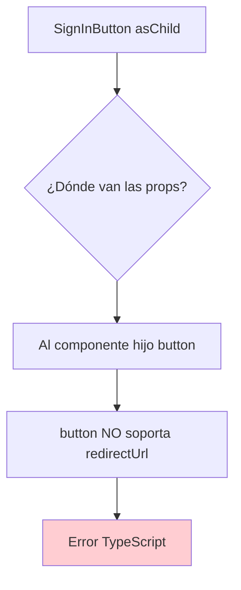

## 🎯 Solución Identificada: Error TypeScript con asChild + redirectUrl

He completado un análisis exhaustivo usando **Sequential Thinking** y **Context7 MCP** para resolver el error de TypeScript que estás experimentando.

### 🔍 Causa Raíz Confirmada

**Error**: `Property 'redirectUrl' does not exist on type 'IntrinsicAttributes & Props<"button">'`

**Explicación**: Cuando usas `asChild` con `SignInButton`/`SignUpButton`, las props como `redirectUrl` se intentan pasar al componente hijo (`<button>`), que no las soporta.



### 📚 Documentación Oficial Confirmada

Según **Context7 MCP**, los ejemplos oficiales de Clerk para `asChild` **NO incluyen** props de redirección:

```astro
<!-- ✅ Correcto según documentación oficial -->
<SignInButton asChild>
  <button>Custom sign in button</button>
</SignInButton>

<!-- ❌ Incorrecto - causa errores TypeScript -->
<SignInButton asChild redirectUrl="/settings">
  <button>Custom sign in button</button>
</SignInButton>
```

### 🚀 Soluciones Disponibles

**Opción 1**: Remover `asChild` (mantener redirectUrl)
**Opción 2**: Remover `redirectUrl` (mantener asChild)  
**Opción 3**: **Configuración Global** (mantener ambos) ⭐ **Recomendada**

### 🎯 Solución Recomendada: Variables de Entorno

**Ventajas**:
- ✅ Mantiene botones personalizados con `asChild`
- ✅ Preserva redirects automáticos
- ✅ Elimina errores de TypeScript
- ✅ Configuración global para toda la app

**Implementación**:

**1. Actualizar `.env.local`:**
```env
PUBLIC_CLERK_PUBLISHABLE_KEY=pk_test_Z3VpZGluZy10ZXJyaWVyLTMzLmNsZXJrLmFjY291bnRzLmRldiQ
CLERK_SECRET_KEY=sk_test_EwDw1Y00h17XNhuhlu5e0h1roq5owGGvaTFuAvWkhm
CLERK_SIGN_IN_FALLBACK_REDIRECT_URL=/settings
CLERK_SIGN_UP_FALLBACK_REDIRECT_URL=/settings
```

**2. Actualizar `AuthSection.astro`:**
```astro
<!-- Remover redirectUrl y fallbackRedirectUrl, mantener asChild -->
<SignInButton mode="modal" asChild>
  <button class="w-full bg-desertHighlightGold...">
    <svg>...</svg>
    <span>Sign In</span>
  </button>
</SignInButton>
```

### 📋 Plan Detallado Documentado

He creado un análisis completo en [`memory-bank/clerk-aschild-redirect-fix.md`](memory-bank/clerk-aschild-redirect-fix.md) que incluye:

- ✅ **Análisis técnico** de la causa raíz
- ✅ **3 opciones de solución** con pros/contras
- ✅ **Código específico** para cada opción
- ✅ **Checklist de verificación** post-corrección
- ✅ **Referencias** a documentación oficial

### 🎯 Resultado Esperado

Después de implementar la solución:
- ✅ Sin errores de TypeScript
- ✅ Botones personalizados funcionando
- ✅ Redirects automáticos a `/settings`
- ✅ Modales abren correctamente
- ✅ Funcionalidad completa preservada