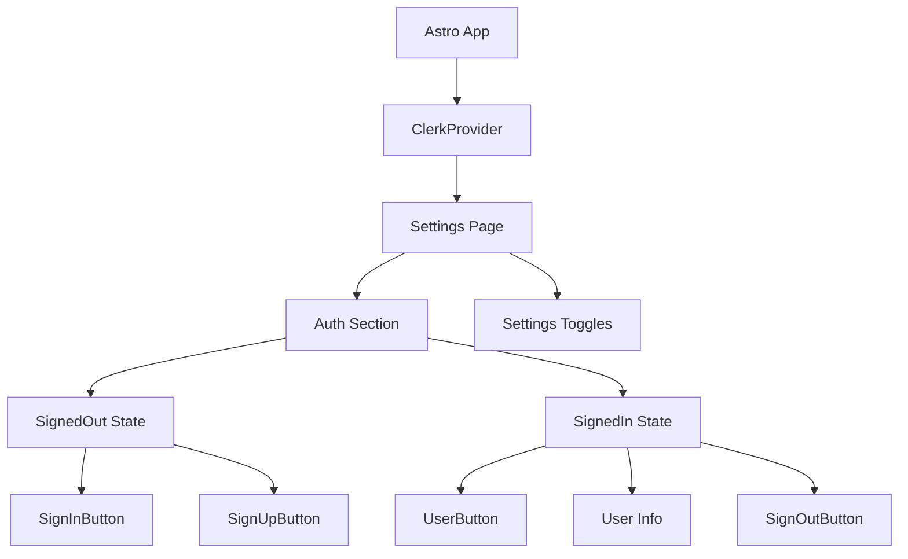

# Plan de Implementación: Autenticación con Clerk en Settings

## 🎯 Objetivo

Agregar una sección de login/signup a la página de configuración usando Clerk para autenticación, manteniendo la consistencia visual con el diseño glassmorphism existente.

## 📋 Análisis de la Situación Actual

### Estructura Actual de Settings
- **Página**: `apps/quranexpo-web/src/pages/settings.astro`
- **Componentes**: `SettingsToggle.tsx` para toggles individuales
- **Diseño**: Contenedor glassmorphism con dos toggles (Autoplay Verses, Show Translation)
- **Estilo**: `bg-white/10 backdrop-blur-xl border border-white/20 rounded-3xl p-4`

### Tecnologías Actuales
- **Framework**: Astro con Preact
- **Estado**: Nanostores (`@nanostores/preact`)
- **Estilos**: TailwindCSS con tema personalizado
- **Colores**: `textPrimary`, `desertHighlightGold`, `skyDeepBlue`, etc.

## 🏗️ Arquitectura de la Solución

### Integración con Clerk


### Componentes de Clerk a Utilizar
1. **`SignedIn`** - Renderiza contenido solo para usuarios autenticados
2. **`SignedOut`** - Renderiza contenido solo para usuarios no autenticados
3. **`SignInButton`** - Botón para iniciar sesión
4. **`SignUpButton`** - Botón para registrarse
5. **`UserButton`** - Botón con avatar y menú de usuario
6. **`SignOutButton`** - Botón para cerrar sesión

## 🎨 Diseño de la UI

### Layout Propuesto
```
┌─────────────────────────────────────┐
│           Configuración             │
├─────────────────────────────────────┤
│  ┌─────────────────────────────┐    │
│  │     Account Section         │    │
│  │  ┌─────────────────────┐    │    │
│  │  │ [SignedOut]         │    │    │
│  │  │ Sign In | Sign Up   │    │    │
│  │  └─────────────────────┘    │    │
│  │  ┌─────────────────────┐    │    │
│  │  │ [SignedIn]          │    │    │
│  │  │ UserButton + Info   │    │    │
│  │  └─────────────────────┘    │    │
│  └─────────────────────────────┘    │
├─────────────────────────────────────┤
│  ┌─────────────────────────────┐    │
│  │    App Settings             │    │
│  │  Autoplay Verses     [○]    │    │
│  │  Show Translation    [●]    │    │
│  └─────────────────────────────┘    │
└─────────────────────────────────────┘
```

## 🔧 Pasos de Implementación

### Fase 1: Configuración Inicial de Clerk

#### 1.1 Instalación
```bash
cd apps/quranexpo-web
npm install @clerk/astro
```

#### 1.2 Variables de Entorno
```env
# .env.local
PUBLIC_CLERK_PUBLISHABLE_KEY=pk_test_...
CLERK_SECRET_KEY=sk_test_...
```

#### 1.3 Configuración de Middleware
```typescript
// src/middleware.ts
import { clerkMiddleware } from '@clerk/astro/server';
export const onRequest = clerkMiddleware();
```

#### 1.4 Configuración de Astro
```javascript
// astro.config.mjs
import { defineConfig } from 'astro/config';
import preact from '@astrojs/preact';
import clerk from '@clerk/astro';

export default defineConfig({
  integrations: [preact(), clerk()],
  output: 'server'
});
```

### Fase 2: Creación de Componentes

#### 2.1 Crear `AuthSection.tsx`
- Componente principal de autenticación
- Estados SignedIn/SignedOut
- Botones personalizados con tema de la app
- Integración con UserButton

#### 2.2 Actualizar `settings.astro`
- Agregar ClerkProvider
- Incluir AuthSection
- Reorganizar layout con dos secciones

### Fase 3: Estilos y Tema

#### 3.1 Personalización de Clerk
- Configurar appearance para UserButton
- Adaptar colores al tema existente
- Mantener consistencia glassmorphism

#### 3.2 Responsive Design
- Asegurar funcionamiento en móviles
- Mantener safe-area-inset
- Scroll apropiado

### Fase 4: Testing y Refinamiento

#### 4.1 Funcionalidad
- Flujos de login/signup
- Persistencia de sesión
- Redirecciones apropiadas

#### 4.2 UX/UI
- Transiciones suaves
- Estados de carga
- Manejo de errores

## 📁 Archivos a Crear/Modificar

### Archivos Nuevos
1. `src/components/AuthSection.tsx` - Componente principal de auth
2. `src/middleware.ts` - Middleware de Clerk

### Archivos a Modificar
1. `src/pages/settings.astro` - Agregar ClerkProvider y AuthSection
2. `astro.config.mjs` - Configuración de Clerk
3. `package.json` - Dependencia @clerk/astro
4. `.env.local` - Variables de entorno

## 🎯 Resultado Esperado

### Funcionalidades
- ✅ Login/Signup modal desde settings
- ✅ Información de usuario autenticado
- ✅ Logout funcional
- ✅ Persistencia de sesión
- ✅ Integración visual perfecta

### Beneficios
- **Autenticación robusta** con Clerk
- **UI consistente** con el diseño existente
- **Experiencia fluida** para el usuario
- **Escalabilidad** para futuras funciones de usuario
- **Seguridad** enterprise-grade

## 🚀 Próximos Pasos

1. **Implementar** configuración inicial de Clerk
2. **Crear** componente AuthSection
3. **Integrar** en página de settings
4. **Probar** flujos de autenticación
5. **Refinar** estilos y UX
6. **Documentar** en Memory Bank