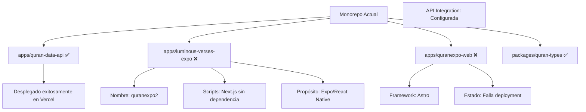
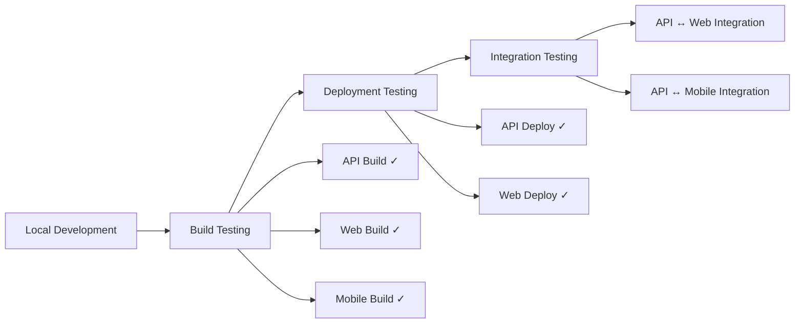

# Plan de Reorganización del Monorepo para Deployment

**Fecha:** 2025-05-25
**Versión:** 1.0
**Objetivo:** Limpiar y organizar correctamente toda la configuración del monorepo antes de deployment

## Análisis del Problema Actual

### Problemas Identificados en Logs de Deployment

```
quranexpo2:build: sh: line 1: next: command not found
```

**Root Causes:**
1. **Confusión de Nombres**: `luminous-verses-expo` tiene nombre de paquete `quranexpo2`
2. **Scripts Incorrectos**: Proyecto Expo configurado con scripts de Next.js
3. **Build del Monorepo Completo**: Vercel ejecuta `turbo build` en todos los proyectos
4. **Dependencias Faltantes**: Next.js referenciado pero no instalado

### Estado Actual de Proyectos



## Plan de Reorganización

### Fase 1: Corrección de Estructura de Proyectos

#### 1.1 Reorganización de Nombres y Propósitos

**Estructura Objetivo:**
```
apps/
├── quran-data-api/          # API Serverless (✅ Ya funcional)
├── luminous-verses-mobile/  # Expo/React Native (Renombrar)
├── quranexpo-web/          # Astro Web App
└── admin-panel/ (futuro)   # Panel de administración

packages/
├── quran-types/            # Tipos compartidos
├── ui-components/ (futuro) # Componentes compartidos
└── utils/ (futuro)         # Utilidades compartidas
```

#### 1.2 Corrección de luminous-verses-expo

**Cambios Necesarios:**
- Renombrar a `luminous-verses-mobile`
- Corregir nombre en package.json: `quranexpo2` → `@quran-monorepo/luminous-verses-mobile`
- Eliminar scripts de Next.js
- Configurar scripts de Expo correctos
- Limpiar dependencias conflictivas

#### 1.3 Optimización de quranexpo-web

**Cambios Necesarios:**
- Verificar configuración de Astro
- Optimizar scripts de build
- Configurar outputs correctos para Vercel

### Fase 2: Configuración de TurboRepo

#### 2.1 turbo.json Optimizado

```json
{
  "$schema": "https://turbo.build/schema.json",
  "globalEnv": [
    "DATABASE_URL",
    "NEON_DATABASE_URL", 
    "EDGE_CONFIG",
    "BLOB_READ_WRITE_TOKEN"
  ],
  "tasks": {
    "build": {
      "dependsOn": ["^build"],
      "outputs": ["dist/**", ".next/**", "build/**"]
    },
    "build:web": {
      "dependsOn": ["^build"],
      "outputs": ["dist/**", "build/**"]
    },
    "build:api": {
      "dependsOn": ["^build"],  
      "outputs": ["dist/**"]
    },
    "build:mobile": {
      "dependsOn": ["^build"],
      "outputs": []
    },
    "dev": {
      "cache": false,
      "persistent": true
    },
    "lint": {
      "outputs": []
    },
    "type-check": {
      "dependsOn": ["^build"],
      "outputs": []
    }
  }
}
```

#### 2.2 Scripts de Package.json Root

```json
{
  "scripts": {
    "dev": "turbo dev",
    "build": "turbo build",
    "build:web": "turbo run build:web --filter=quranexpo-web",
    "build:api": "turbo run build:api --filter=@quran-monorepo/quran-data-api", 
    "build:mobile": "turbo run build:mobile --filter=@quran-monorepo/luminous-verses-mobile",
    "dev:web": "turbo run dev --filter=quranexpo-web",
    "dev:api": "turbo run dev --filter=@quran-monorepo/quran-data-api",
    "lint": "turbo lint",
    "type-check": "turbo type-check"
  }
}
```

### Fase 3: Configuración de Deployment en Vercel

#### 3.1 quran-data-api (Ya funcional)
- Framework: Other
- Root Directory: `apps/quran-data-api`
- Build Command: `pnpm run build`
- Output Directory: `.`

#### 3.2 quranexpo-web (Por configurar)
- Framework: Astro
- Root Directory: `apps/quranexpo-web`  
- Build Command: `pnpm run build`
- Output Directory: `dist`

### Fase 4: Exclusión de Proyectos No-Web del Build

#### 4.1 Configuración de Filtros
- Configurar turbo.json para excluir mobile del build web
- Crear tasks específicos por tipo de proyecto
- Optimizar caching strategy

#### 4.2 Environment Variables Organization
- Variables globales en root
- Variables específicas por proyecto
- Separación de concerns entre API y Web

### Fase 5: Testing y Validación



## Cronograma de Implementación

### Etapa 1 (Inmediata): Fixes Críticos
1. Corregir configuración de luminous-verses-expo
2. Actualizar turbo.json con tasks específicos
3. Configurar build exclusions
4. Testing local de builds

### Etapa 2 (Corto plazo): Deployment Optimization
1. Configurar Vercel project para quranexpo-web
2. Testing de deployment
3. Verificación de integration con API
4. Performance testing

### Etapa 3 (Mediano plazo): Structural Improvements
1. Shared packages optimization
2. CI/CD configuration
3. Documentation updates
4. Monitoring and alerting

## Success Criteria

- ✅ quran-data-api sigue funcionando correctamente
- ✅ quranexpo-web se despliega exitosamente en Vercel
- ✅ luminous-verses-mobile mantiene su funcionalidad (desarrollo local)
- ✅ Builds son rápidos y eficientes
- ✅ Deployments son predecibles y confiables
- ✅ Integration entre API y Web funciona perfectamente

## Próximos Pasos Inmediatos

1. Comenzar con corrección de luminous-verses-expo package.json
2. Actualizar turbo.json con configuración optimizada
3. Testing local de builds por proyecto
## ❌ PROBLEMA CRÍTICO IDENTIFICADO EN VERCEL DEPLOYMENT

**Fecha:** 2025-05-25 11:08 AM
**Error:** `No Output Directory named "dist" found after the Build completed`

### Análisis del Log de Error

```
• Packages in scope: @quran-monorepo/luminous-verses-mobile, @quran-monorepo/quran-data-api, @quran-monorepo/quran-types
• Running build in 3 packages
Error: No Output Directory named "dist" found after the Build completed.
```

### Root Cause Identificada

**🚨 TurboRepo NO está detectando `quranexpo-web` durante el build**

**Causa Principal:**
- `apps/quranexpo-web/package.json` tiene `"name": "quranexpo-web"`
- Los otros proyectos usan formato `@quran-monorepo/[nombre]`
- Esta inconsistencia hace que TurboRepo no incluya `quranexpo-web` en el scope del workspace

### Solución Inmediata (Requiere Modo Code)

#### Fix 1: Corregir Nombre del Paquete
**Archivo:** `apps/quranexpo-web/package.json`
```diff
{
- "name": "quranexpo-web",
+ "name": "@quran-monorepo/quranexpo-web",
  "type": "module",
  "version": "0.0.1",
  // ... resto igual
}
```

#### Fix 2: Actualizar Referencias
**Archivo:** `package.json` (raíz)
```diff
{
  "scripts": {
-   "build:web": "turbo run build --filter=quranexpo-web",
+   "build:web": "turbo run build --filter=@quran-monorepo/quranexpo-web",
    // ... resto igual
  }
}
```

#### Fix 3: Verificar Configuración TurboRepo
**Archivo:** `turbo.json`
- Asegurar que `build:web` task esté correctamente definido
- Verificar outputs para proyectos Astro: `["dist/**"]`

### Validación Post-Fix

Después de aplicar los fixes:

1. **Test Local:**
   ```bash
   pnpm install
   pnpm run build:web
   ```

2. **Verificar Output:**
   - Debe existir `apps/quranexpo-web/dist/`
   - TurboRepo debe mostrar `@quran-monorepo/quranexpo-web` en scope

3. **Deployment en Vercel:**
   - Framework: `Astro`
   - Root Directory: `apps/quranexpo-web`
   - Build Command: `pnpm run build`
   - Output Directory: `dist`

### Prioridad

**🔥 CRÍTICO - BLOQUEA DEPLOYMENT**
- Esta corrección debe aplicarse antes de cualquier nuevo intento de deployment en Vercel
- Sin esta corrección, `quranexpo-web` nunca se construirá exitosamente
4. Configuración de Vercel para quranexpo-web