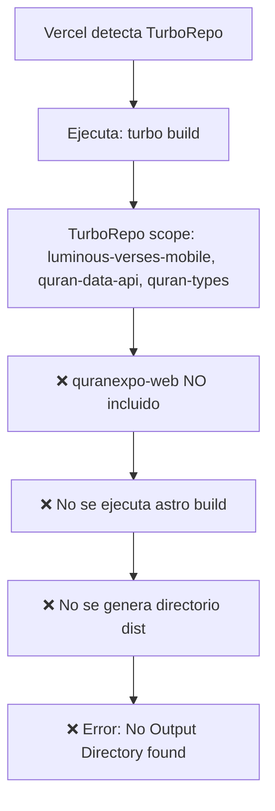
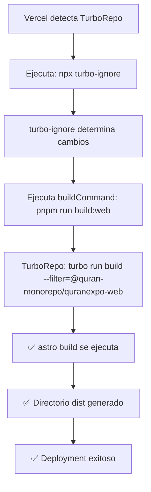

# Solución Definitiva para Deployment de quranexpo-web en Vercel

**Fecha:** 2025-05-25  
**Estado:** ANÁLISIS COMPLETO - SOLUCIÓN IDENTIFICADA  
**Prioridad:** CRÍTICA  

## 🔍 Diagnóstico Completo

### ❌ Problema Confirmado en Logs de Vercel

```
[12:02:31.313] • Packages in scope: @quran-monorepo/luminous-verses-mobile, @quran-monorepo/quran-data-api, @quran-monorepo/quran-types

[12:02:32.057] Error: No Output Directory named "dist" found after the Build completed.
```

**Causa Raíz:** TurboRepo NO incluye `@quran-monorepo/quranexpo-web` en el scope de build, por lo tanto:
1. ❌ `astro build` nunca se ejecuta
2. ❌ Directorio `dist` nunca se genera
3. ❌ Vercel falla al no encontrar output directory

### ✅ Configuración Actual Correcta

- **pnpm-workspace.yaml**: ✅ Incluye `apps/*`
- **package.json nombres**: ✅ `@quran-monorepo/quranexpo-web`
- **astro.config.mjs**: ✅ `outDir: './dist'` configurado
- **turbo.json**: ✅ Tasks definidas correctamente
- **vercel.json**: ✅ Existe pero `ignoreCommand: "exit 1"` NO funciona

### 🚨 Problema Principal

**Vercel detecta TurboRepo automáticamente y ejecuta `turbo build` ignorando completamente el `vercel.json`**

## 📋 Solución Definitiva: turbo-ignore

Según documentación oficial de TurboRepo, la solución recomendada es usar `turbo-ignore`:

### 1. **Actualizar vercel.json**

```json
{
  "buildCommand": "cd ../.. && pnpm run build:web",
  "outputDirectory": "dist",
  "installCommand": "cd ../.. && pnpm install",
  "framework": null,
  "nodeVersion": "18.x",
  "ignoreCommand": "npx turbo-ignore"
}
```

### 2. **Verificar que el Build Command funciona localmente**

```bash
# Test desde la raíz del monorepo
pnpm run build:web
```

Debe ejecutar:
```bash
turbo run build --filter=@quran-monorepo/quranexpo-web
```

## 🔄 Flujo Esperado vs Actual

### Flujo Actual (Fallido)


### Flujo Esperado (Con turbo-ignore)


## 🎯 Plan de Implementación

### Paso 1: Actualizar vercel.json
- Cambiar `"ignoreCommand": "exit 1"` por `"ignoreCommand": "npx turbo-ignore"`

### Paso 2: Test Local
- Ejecutar `pnpm run build:web` desde la raíz
- Verificar que genera `apps/quranexpo-web/dist/`

### Paso 3: Deploy en Vercel
- Commit y push cambios
- Monitorear logs para confirmar que:
  - `turbo-ignore` se ejecuta
  - `buildCommand` personalizado se usa
  - `@quran-monorepo/quranexpo-web` aparece en scope
  - Se genera directorio `dist`

## 📊 Configuración Validada

```json
// apps/quranexpo-web/vercel.json (ACTUALIZADO)
{
  "buildCommand": "cd ../.. && pnpm run build:web",
  "outputDirectory": "dist",
  "installCommand": "cd ../.. && pnpm install",
  "framework": null,
  "nodeVersion": "18.x",
  "ignoreCommand": "npx turbo-ignore"
}
```

```javascript
// apps/quranexpo-web/astro.config.mjs (YA CORRECTO)
export default defineConfig({
  output: 'static',
  outDir: './dist',  // ✅ Correcto
  // ... resto de configuración
});
```

## ⚠️ Riesgo y Rollback

- **Riesgo:** BAJO - Solo cambio de `exit 1` a `turbo-ignore`
- **Rollback:** Fácil - revertir a `"ignoreCommand": "exit 1"`
- **Tiempo estimado:** 10 minutos implementación + 5 minutos testing

## 🎯 Criterios de Éxito

En los próximos logs de Vercel deberíamos ver:

1. ✅ `npx turbo-ignore` ejecutándose
2. ✅ `pnpm run build:web` ejecutándose
3. ✅ `@quran-monorepo/quranexpo-web` en TurboRepo scope
4. ✅ `astro build` completándose exitosamente
5. ✅ `dist/` directory encontrado
6. ✅ Deployment exitoso

---

**Next Action:** Cambiar a modo Code para implementar el fix del `turbo-ignore`