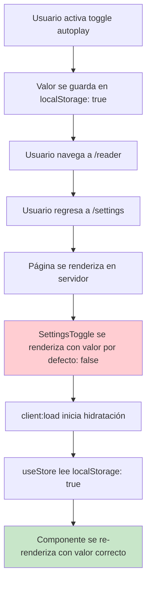

# Corrección: Toggle de Autoplay Resetea a OFF al Navegar

## 🚨 Problema Identificado

**Comportamiento Actual**: Cuando el usuario activa el toggle de autoplay, navega a la página del reader, y luego regresa a settings, el toggle aparece en posición OFF aunque el valor real esté guardado como ON.

**Causa Raíz**: Problema de hidratación SSR con `client:load` en el componente `SettingsToggle`.

## 🔍 Análisis Técnico

### Flujo del Problema



### Causa Específica

En `settings.astro`, línea 22:
```astro
<SettingsToggle
  client:load  <!-- ❌ Causa problema de hidratación -->
  label="Autoplay"
  description="Automatically play next ayah"
  storeKey="autoplayEnabled"
  settingKey="autoplayEnabled"
/>
```

**Problema**: `client:load` causa que el componente se renderice primero en el servidor con el valor por defecto (`false`), y luego se hidrate en el cliente con el valor real del localStorage.

### ¿Por qué ocurre esto?

1. **Renderizado SSR**: El servidor no tiene acceso a localStorage, usa valor por defecto
2. **Hidratación**: El cliente carga el valor real de localStorage
3. **Inconsistencia visual**: Hay un momento donde el toggle muestra el estado incorrecto
4. **Navegación**: Cada vez que se navega a la página, se repite el proceso

## 🎯 Soluciones Disponibles

### **Opción 1: Usar `client:only` (Recomendada)**

**Ventajas**: Elimina completamente el problema de hidratación
**Desventajas**: Componente no se renderiza en servidor (pero es aceptable para settings)

```astro
<SettingsToggle
  client:only="preact"  <!-- ✅ Solo se renderiza en cliente -->
  label="Autoplay"
  description="Automatically play next ayah"
  storeKey="autoplayEnabled"
  settingKey="autoplayEnabled"
/>
```

### **Opción 2: Crear ClientOnlySettingsToggle**

**Ventajas**: Más control sobre la hidratación
**Desventajas**: Requiere componente adicional

```tsx
// ClientOnlySettingsToggle.tsx
import { useEffect, useState } from 'preact/hooks';
import SettingsToggle from './SettingsToggle';

interface ClientOnlySettingsToggleProps {
  label: string;
  description: string;
  storeKey: 'autoplayEnabled' | 'showTranslation';
  settingKey: 'autoplayEnabled' | 'showTranslation';
}

const ClientOnlySettingsToggle = (props: ClientOnlySettingsToggleProps) => {
  const [mounted, setMounted] = useState(false);

  useEffect(() => {
    setMounted(true);
  }, []);

  if (!mounted) {
    return (
      <div className="flex items-center justify-between w-full py-3 border-b border-white/10 last:border-b-0">
        <div className="flex flex-col">
          <span className="text-textPrimary text-lg font-englishMedium">{props.label}</span>
          <span className="text-textSecondary text-sm">{props.description}</span>
        </div>
        <div className="w-11 h-6 bg-gray-200 rounded-full animate-pulse"></div>
      </div>
    );
  }

  return <SettingsToggle {...props} />;
};

export default ClientOnlySettingsToggle;
```

### **Opción 3: Mejorar SettingsToggle con estado de hidratación**

**Ventajas**: Solución en el mismo componente
**Desventajas**: Más complejo

```tsx
// SettingsToggle.tsx mejorado
import { useStore } from '@nanostores/preact';
import { useEffect, useState } from 'preact/hooks';
import { autoplayEnabled, showTranslation } from '../stores/settingsStore.ts';

const SettingsToggle = ({ label, description, settingKey, storeKey, class: className }) => {
  const [hydrated, setHydrated] = useState(false);
  
  let store;
  if (storeKey === 'autoplayEnabled') {
    store = autoplayEnabled;
  } else if (storeKey === 'showTranslation') {
    store = showTranslation;
  } else {
    console.error(`Unknown storeKey: ${storeKey}`);
    return null;
  }

  const checked = useStore(store);

  useEffect(() => {
    setHydrated(true);
  }, []);

  const toggleSetting = () => {
    store.set(!checked);
  };

  return (
    <div className={`flex items-center justify-between w-full py-3 border-b border-white/10 last:border-b-0 ${className || ''}`}>
      <div className="flex flex-col">
        <span className="text-textPrimary text-lg font-englishMedium">{label}</span>
        <span className="text-textSecondary text-sm">{description}</span>
      </div>
      <label className="relative inline-flex items-center cursor-pointer">
        <input 
          type="checkbox" 
          value="" 
          className="sr-only peer" 
          checked={hydrated ? checked : false}  // ✅ Solo muestra estado real después de hidratación
          onInput={toggleSetting} 
        />
        <div className={`w-11 h-6 bg-gray-200 peer-focus:outline-none peer-focus:ring-4 peer-focus:ring-blue-300 dark:peer-focus:ring-blue-800 rounded-full peer dark:bg-gray-700 peer-checked:after:translate-x-full peer-checked:after:border-white after:content-[''] after:absolute after:top-[2px] after:left-[2px] after:bg-white after:border-gray-300 after:border after:rounded-full after:h-5 after:w-5 after:transition-all dark:border-gray-600 peer-checked:bg-blue-600 ${!hydrated ? 'opacity-50' : ''}`}></div>
      </label>
    </div>
  );
};
```

## 🚀 Solución Recomendada: Opción 1

### Implementación

**Actualizar `settings.astro`:**

```astro
---
import AuthSection from '../components/AuthSection.astro';
import BackButton from '../components/BackButton.tsx';
import SettingsToggle from '../components/SettingsToggle.tsx';
import Layout from '../layouts/Layout.astro';
---

<Layout title="Settings - QuranExpo">
  <main class="min-h-screen bg-gradient-to-br from-skyLightBlue via-skyMediumBlue to-skyDeepBlue p-4">
    <BackButton client:load />
    <div class="max-w-md mx-auto pt-8 space-y-6">
      
      <!-- Account Section -->
      <AuthSection client:load />
      
      <!-- App Settings Section -->
      <div class="bg-glassmorphism-strong backdrop-blur-md rounded-xl p-6 border border-white/20">
        <h2 class="text-xl font-semibold text-textPrimary mb-4">App Settings</h2>
        
        <div class="space-y-4">
          <SettingsToggle
            client:only="preact"  <!-- ✅ CAMBIO: client:load → client:only="preact" -->
            label="Autoplay"
            description="Automatically play next ayah"
            storeKey="autoplayEnabled"
            settingKey="autoplayEnabled"
          />
          
          <SettingsToggle
            client:only="preact"  <!-- ✅ CAMBIO: client:load → client:only="preact" -->
            label="Show Translation"
            description="Display English translation"
            storeKey="showTranslation"
            settingKey="showTranslation"
          />
        </div>
      </div>
      
    </div>
  </main>
</Layout>
```

## ✅ Verificación de la Solución

### Comportamiento Esperado Post-Corrección:

1. **Activar toggle**: ✅ Toggle se activa y valor se guarda
2. **Navegar a reader**: ✅ Navegación normal
3. **Regresar a settings**: ✅ Toggle mantiene estado correcto (ON)
4. **Sin parpadeo**: ✅ No hay cambio visual durante carga

### Checklist de Pruebas:

- [ ] Activar toggle de autoplay en settings
- [ ] Verificar que toggle está en posición ON
- [ ] Navegar a página del reader (/reader/1)
- [ ] Regresar a settings (/settings)
- [ ] Verificar que toggle sigue en posición ON
- [ ] Repetir proceso varias veces
- [ ] Probar con toggle de translation también

## 🎯 Beneficios de Esta Corrección

1. **Consistencia Visual**: Toggle siempre muestra el estado correcto
2. **Mejor UX**: Sin parpadeo o cambios visuales inesperados
3. **Persistencia Confiable**: Estado se mantiene entre navegaciones
4. **Solución Simple**: Cambio mínimo de código
5. **Rendimiento**: `client:only` es más eficiente para componentes que dependen de localStorage

## 📚 Contexto Técnico

### ¿Por qué `client:only` es mejor aquí?

1. **No hay beneficio SSR**: Los settings no necesitan renderizado en servidor
2. **Depende de localStorage**: Solo funciona en el cliente de todos modos
3. **Elimina hidratación**: No hay mismatch entre servidor y cliente
4. **Más rápido**: No hay proceso de hidratación

### ¿Cuándo usar cada directiva?

- **`client:load`**: Componentes que necesitan hidratación inmediata
- **`client:only`**: Componentes que solo funcionan en cliente (localStorage, APIs del navegador)
- **`client:visible`**: Componentes que pueden cargar cuando son visibles
- **`client:idle`**: Componentes no críticos que pueden cargar cuando el navegador esté idle

## 🔧 Implementación

### Archivos a Modificar:
- `apps/quranexpo-web/src/pages/settings.astro` (líneas 22 y 30)

### Cambios Específicos:
- Cambiar `client:load` por `client:only="preact"` en ambos SettingsToggle

### Comando de Verificación:
```bash
cd apps/quranexpo-web
npm run dev
# Probar flujo: settings → toggle ON → reader → settings → verificar toggle ON