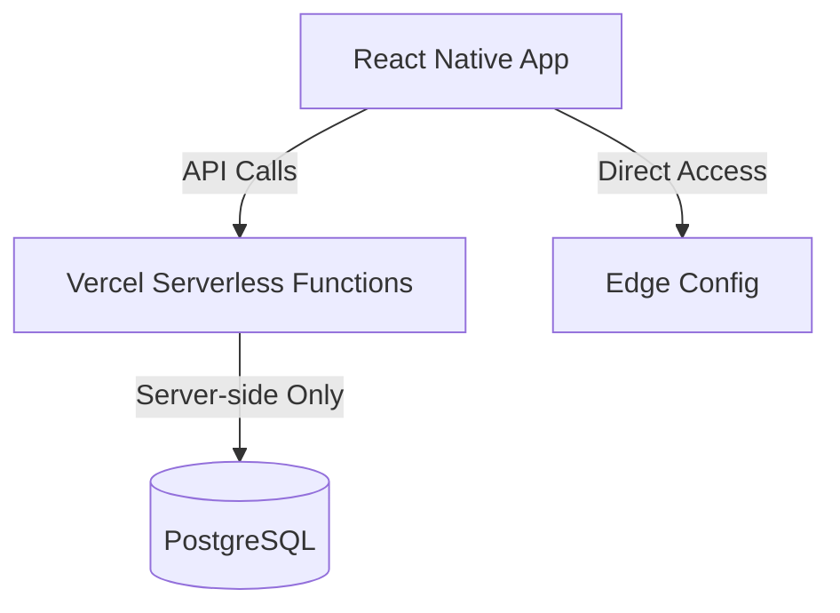

# QuranExpo2 Runtime Error Solution Plan

## Problem Analysis

The current deployment of QuranExpo2 is failing with the following error:

```
iOS Bundling failed 4264ms node_modules/expo-router/entry.js (1507 modules)
The package at "node_modules/pgpass/lib/index.js" attempted to import the Node standard library module "fs".
It failed because the native React runtime does not include the Node standard library.
```

This is occurring because:

1. The `quranMetadataService.ts` file imports the Node.js PostgreSQL client (`pg`) directly in code that gets bundled for the client
2. React Native doesn't include Node.js standard library modules like `fs` which `pg` and its dependencies (like `pgpass`) require
3. When Metro bundler tries to include these server-side modules in the client-side bundle, it fails

## Architecture Solution

We need to maintain proper client/server separation according to React Native and Expo best practices:



Our solution will involve:

1. Moving all direct database access to server-side API endpoints
2. Refactoring client code to use API calls instead of direct database access
3. Keeping the Edge Config direct access on the client since it's designed for client-side use

## Implementation Steps

### 1. Create a New API Endpoint for Metadata

Create `api/get-metadata.ts` to handle metadata requests. This will be a server-side function that can safely use Node.js modules:

```typescript
// api/get-metadata.ts
const { VercelRequest, VercelResponse } = require('@vercel/node');
const { Pool } = require('pg');

// Initialize the connection pool (same as other API endpoints)
const pool = new Pool({
  connectionString: process.env.NEON_DATABASE_URL,
  ssl: {
    rejectUnauthorized: false,
  },
  max: 1,
  idleTimeoutMillis: 5000,
  connectionTimeoutMillis: 10000,
});

pool.on('error', (err) => {
  console.error('Unexpected error on idle client in pool (get-metadata)', err);
});

module.exports = async function handler(req: typeof VercelRequest, res: typeof VercelResponse) {
  const { type } = req.query;
  
  let client;
  try {
    client = await pool.connect();
    
    // Handle different metadata requests
    if (type === 'surah-list') {
      const result = await client.query(
        'SELECT number, arabic_name AS name, transliteration AS tname, ' +
        'english_name AS ename, ayas, revelation_type AS type, chronological_order AS "order", rukus ' +
        'FROM quran_surahs ORDER BY number'
      );
      return res.status(200).json(result.rows);
    } 
    else if (type === 'sajdas') {
      const result = await client.query(
        'SELECT sajda_id, surah_number, ayah_number, type FROM quran_sajdas ORDER BY surah_number, ayah_number'
      );
      return res.status(200).json(result.rows);
    }
    else if (type === 'navigation-indices') {
      // Add query for navigation indices if stored in DB
      return res.status(501).json({ error: 'Not implemented' });
    }
    
    return res.status(400).json({ error: 'Invalid metadata type requested' });
  } catch (err: any) {
    console.error(`Error fetching metadata (${type}):`, err);
    return res.status(500).json({ error: 'Database error', message: err.message });
  } finally {
    if (client) client.release();
  }
}
```

### 2. Update API Client to Handle Metadata Requests

Extend `src/services/apiClient.ts` with a new function to fetch metadata:

```typescript
// Add to src/services/apiClient.ts

/**
 * Fetches metadata from the API.
 * @param type The type of metadata to fetch: 'surah-list', 'sajdas', etc.
 * @returns A Promise resolving to the requested metadata or null if there was an error.
 */
export async function fetchMetadataFromAPI<T>(type: string): Promise<T | null> {
  if (!API_BASE_URL) {
    throw new Error('API_BASE_URL is not configured. Cannot fetch metadata.');
  }
  try {
    const response = await fetch(`${API_BASE_URL}/api/get-metadata?type=${type}`);
    if (!response.ok) {
      const errorData = await response.text();
      console.error(`API error fetching metadata (${type}): ${response.status}`, errorData);
      throw new Error(`Failed to fetch metadata. Status: ${response.status}`);
    }
    return await response.json() as T;
  } catch (error) {
    console.error(`Error in fetchMetadataFromAPI (${type}):`, error);
    throw error; // Re-throw to be handled by the caller
  }
}
```

### 3. Modify quranMetadataService.ts

Remove direct DB access and update to use Edge Config + API calls:

```typescript
// src/services/quranMetadataService.ts
import { createClient, EdgeConfigClient } from '@vercel/edge-config';
import { fetchMetadataFromAPI } from './apiClient';

// Types remain the same
// ...existing interface definitions...

let edgeConfigClient: EdgeConfigClient | undefined;
const edgeConfigConnectionString = process.env.EDGE_CONFIG;

if (edgeConfigConnectionString) {
  try {
    edgeConfigClient = createClient(edgeConfigConnectionString);
  } catch (error) {
    console.error("Failed to create Edge Config client:", error);
  }
}

// Use Edge Config with API fallback instead of DB fallback
export async function getBasicSurahList(): Promise<SurahBasicInfo[] | null> {
  if (edgeConfigClient) {
    try {
      const metadata = await edgeConfigClient.get('quranMetadata') as QuranEdgeConfigData | undefined;
      if (metadata && typeof metadata === 'object' && metadata.surahBasicInfo) {
        return metadata.surahBasicInfo;
      }
    } catch (error) {
      console.error('Edge Config error, falling back to API:', error);
      // Fall through to API fallback
    }
  }
  
  // Fallback to API instead of direct DB connection
  try {
    const surahList = await fetchMetadataFromAPI<SurahBasicInfo[]>('surah-list');
    return surahList;
  } catch (apiError) {
    console.error("API error fetching basic surah list:", apiError);
    return null;
  }
}

// Similar approach for other functions
export async function getSajdaVerses(): Promise<SajdaVerse[] | null> {
  try {
    const sajdaVerses = await fetchMetadataFromAPI<SajdaVerse[]>('sajdas');
    return sajdaVerses;
  } catch (apiError) {
    console.error("API error fetching sajda verses:", apiError);
    return null;
  }
}

export async function getNavigationIndices(): Promise<NavigationIndices | null> {
  if (edgeConfigClient) {
    try {
      const metadata = await edgeConfigClient.get('quranMetadata') as QuranEdgeConfigData | undefined;
      if (metadata && typeof metadata === 'object' && metadata.navigationIndices) {
        return metadata.navigationIndices;
      }
    } catch (error) {
      console.error('Edge Config error in getNavigationIndices:', error);
      // Continue to API fallback
    }
  }
  
  // Fallback to API for navigation indices if available
  try {
    const navigationIndices = await fetchMetadataFromAPI<NavigationIndices>('navigation-indices');
    return navigationIndices;
  } catch (apiError) {
    console.error("API error fetching navigation indices:", apiError);
    return null;
  }
}
```

## Testing Steps

After implementing these changes:

1. Run a local build to verify bundling works without Node.js module errors
2. Test the Vercel deployment to confirm all API endpoints are working correctly
3. Verify Edge Config access is still functioning for fast-path access
4. Test the app's functionality to ensure:
   - Surah list loads correctly
   - Navigation data is accessible
   - Verse data loads properly
   - Audio playback works

## Why This Solution Works

1. It follows the proper architecture pattern for React Native/Expo apps by:
   - Keeping Node.js-specific code on the server side
   - Using API calls for database access
   - Maintaining direct Edge Config access for fast paths
   
2. It preserves our hybrid storage approach while fixing the bundling issues

## Next Steps

1. Implement the server-side API endpoint (`api/get-metadata.ts`)
2. Update the API client with the new method
3. Refactor `quranMetadataService.ts` to remove direct DB access
4. Deploy and test