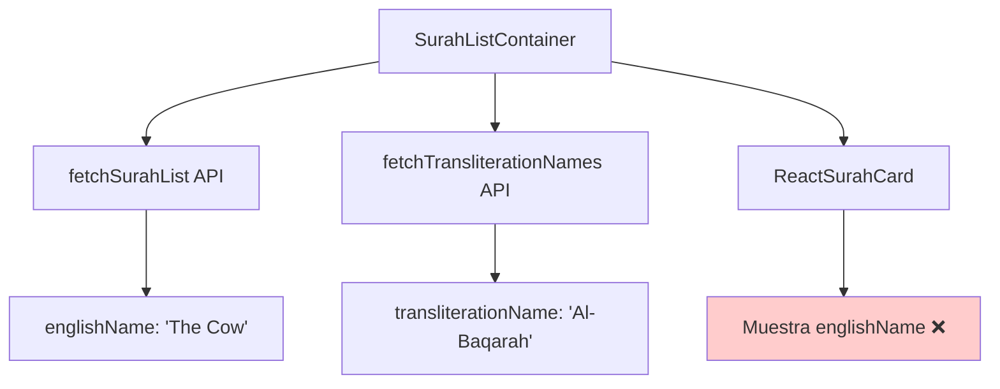

# Plan Detallado: Cambiar Títulos de Surahs a Transliteración Inglesa

## Análisis de la Situación Actual

### Estado Actual
- **Problema**: Los títulos de surahs en la lista usan `englishName` (traducción inglesa) en lugar de `transliterationName` (transliteración inglesa)
- **Ubicación**: [`ReactSurahCard.tsx`](apps/quranexpo-web/src/components/ReactSurahCard.tsx:42) línea 42
- **Ejemplo**: Muestra "The Cow" en lugar de "Al-Baqarah"

### Arquitectura Actual


### Datos Disponibles
1. **`surah.englishName`**: "The Cow", "The Family of Imran", etc.
2. **`surah.transliterationName`**: "Al-Baqarah", "Aal-E-Imran", etc.
3. **Fuente de datos**: 
   - API principal: `item.tname || item.ename` (línea 41 en apiClient.ts)
   - API de transliteración: `/api/transliterations` (Edge Config)

## Plan de Implementación

### Fase 1: Modificar ReactSurahCard
**Archivo**: [`apps/quranexpo-web/src/components/ReactSurahCard.tsx`](apps/quranexpo-web/src/components/ReactSurahCard.tsx)

**Cambio Principal**:
```tsx
// ❌ ACTUAL (línea 42)
<h4 className="text-textEnglish font-englishSemiBold text-lg">
  {surah.englishName}
</h4>

// ✅ NUEVO
<h4 className="text-textEnglish font-englishSemiBold text-lg">
  {surah.transliterationName}
</h4>
```

**Cambio Secundario** (línea 47):
```tsx
// ❌ ACTUAL
<p className="text-textSecondary font-englishRegular text-sm mt-1">
  Chapter {surah.englishName} • {surah.numberOfAyahs} Verses
</p>

// ✅ NUEVO
<p className="text-textSecondary font-englishRegular text-sm mt-1">
  Chapter {surah.transliterationName} • {surah.numberOfAyahs} Verses
</p>
```

### Fase 2: Verificar Datos de Transliteración
**Archivo**: [`apps/quranexpo-web/src/components/SurahListContainer.tsx`](apps/quranexpo-web/src/components/SurahListContainer.tsx)

**Estado Actual** (líneas 31-43):
- ✅ Ya combina datos de transliteración correctamente
- ✅ Ya tiene fallback: `transliterationData[surah.number] || surah.englishName`
- ✅ Ya carga ambas APIs en paralelo

**Verificación Necesaria**:
```tsx
// Línea 39 - Verificar que este mapeo funciona correctamente
transliterationName: transliterationData[surah.number] || surah.englishName
```

### Fase 3: Actualizar Otros Componentes (Si Necesario)

#### 3.1 Verificar SurahDescriptionModal
**Archivo**: [`apps/quranexpo-web/src/components/SurahDescriptionModal.tsx`](apps/quranexpo-web/src/components/SurahDescriptionModal.tsx)

**Líneas a revisar**:
- Línea 178: `{surah.name}` (árabe) ✅ Correcto
- Línea 181: `{surah.englishName}` ❓ Posible cambio a `transliterationName`

#### 3.2 Verificar ReaderSurahHeader
**Archivo**: [`apps/quranexpo-web/src/components/ReaderSurahHeader.tsx`](apps/quranexpo-web/src/components/ReaderSurahHeader.tsx)

**Buscar**: Usos de `englishName` que deberían cambiar a `transliterationName`

### Fase 4: Actualizar Logs y Debug
**Archivo**: [`apps/quranexpo-web/src/components/SurahListContainer.tsx`](apps/quranexpo-web/src/components/SurahListContainer.tsx)

**Línea 62**: Actualizar log de debug
```tsx
// ❌ ACTUAL
console.log(`Surah ${surah.number} - ${surah.englishName} selected`);

// ✅ NUEVO
console.log(`Surah ${surah.number} - ${surah.transliterationName} selected`);
```

## Resultado Esperado

### Antes vs Después

**❌ Antes**:
```
1. The Opening
2. The Cow  
3. The Family of Imran
4. The Women
```

**✅ Después**:
```
1. Al-Fatihah
2. Al-Baqarah
3. Aal-E-Imran
4. An-Nisa
```

### Beneficios
1. **Más auténtico**: Nombres originales transliterados
2. **Consistente**: Alineado con estándares islámicos
3. **Educativo**: Usuarios aprenden nombres árabes
4. **Profesional**: Apariencia más seria y respetuosa

## Archivos a Modificar

### Archivos Principales
1. **`ReactSurahCard.tsx`** - Cambio principal de display
2. **`SurahDescriptionModal.tsx`** - Posible actualización del título
3. **`ReaderSurahHeader.tsx`** - Verificar consistencia

### Archivos de Verificación
1. **`SurahListContainer.tsx`** - Verificar logs de debug
2. **`types/quran.ts`** - ✅ Ya tiene `transliterationName`
3. **`apiClient.ts`** - ✅ Ya mapea correctamente

## Consideraciones Técnicas

### Datos Disponibles
- ✅ **API principal**: `item.tname` disponible
- ✅ **API Edge Config**: `/api/transliterations` como backup
- ✅ **Fallback**: `englishName` si transliteración no disponible

### Compatibilidad
- ✅ **Tipos TypeScript**: `transliterationName` ya definido
- ✅ **Datos cargados**: Ya se obtienen en `SurahListContainer`
- ✅ **Estructura**: No requiere cambios de arquitectura

### Testing
1. **Verificar**: Todos los 114 surahs tienen transliteración
2. **Probar**: Fallback funciona si falta transliteración
3. **Validar**: UI se ve correcta con nombres más largos

## Pasos de Implementación

### Paso 1: Cambio Principal
```bash
# Modificar ReactSurahCard.tsx
# Cambiar englishName → transliterationName en 2 lugares
```

### Paso 2: Verificación
```bash
# Probar la aplicación
# Verificar que todos los surahs muestran transliteración
# Confirmar que no hay errores en consola
```

### Paso 3: Consistencia
```bash
# Revisar otros componentes
# Actualizar SurahDescriptionModal si necesario
# Actualizar logs de debug
```

### Paso 4: Documentación
```bash
# Actualizar Memory Bank
# Documentar el cambio completado
```

## Riesgos y Mitigaciones

### Riesgo 1: Transliteración Faltante
- **Mitigación**: Fallback a `englishName` ya implementado
- **Verificación**: Probar con datos de API real

### Riesgo 2: UI Layout
- **Problema**: Nombres transliterados pueden ser más largos
- **Mitigación**: CSS ya usa `text-lg` y `flex-1` para adaptarse

### Riesgo 3: Consistencia
- **Problema**: Algunos componentes usan `englishName`
- **Mitigación**: Revisar todos los componentes sistemáticamente

## Próximos Pasos

1. **Implementar**: Cambio principal en `ReactSurahCard.tsx`
2. **Probar**: Verificar funcionamiento visual
3. **Revisar**: Otros componentes para consistencia
4. **Documentar**: Actualizar Memory Bank con progreso