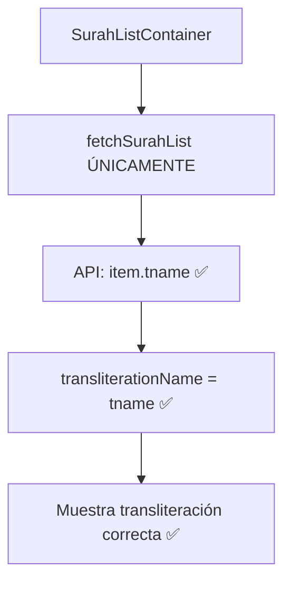

# Plan de Corrección: Problema de Transliteración

## 🔍 Análisis del Problema Raíz

### Problema Identificado
Los títulos de surahs siguen mostrando traducciones inglesas ("The Opening", "The Cow") en lugar de transliteraciones ("Al-Fatihah", "Al-Baqarah").

### Causa Raíz Encontrada
1. **Conflicto de fuentes de datos**: Hay DOS fuentes de transliteración:
   - `fetchSurahList()`: Ya incluye `tname` de la API principal
   - `fetchTransliterationNames()`: Llama a `/api/transliterations` (Edge Config)

2. **Edge Config falla**: El endpoint `/api/transliterations` requiere configuración de Vercel Edge Config que no está disponible:
   ```
   Error: @vercel/edge-config: No connection string provided
   ```

3. **Fallback problemático**: En [`SurahListContainer.tsx`](apps/quranexpo-web/src/components/SurahListContainer.tsx:38):
   ```tsx
   transliterationName: transliterationData[surah.number] || surah.englishName
   ```
   Como `transliterationData` está vacío (por el error de Edge Config), usa `englishName` como fallback.

## 🏗️ Arquitectura Actual vs Corregida

### ❌ Arquitectura Problemática Actual
```mermaid
flowchart TD
    A[SurahListContainer] --> B[fetchSurahList]
    A --> C[fetchTransliterationNames]
    
    B --> D[API: item.tname ✅]
    C --> E[/api/transliterations ❌]
    E --> F[Edge Config Error]
    F --> G[transliterationData = {}]
    G --> H[Fallback a englishName ❌]
```

### ✅ Arquitectura Corregida


## 📋 Plan de Implementación

### Fase 1: Simplificar SurahListContainer
**Archivo**: [`apps/quranexpo-web/src/components/SurahListContainer.tsx`](apps/quranexpo-web/src/components/SurahListContainer.tsx)

**Cambios**:

1. **Eliminar import de fetchTransliterationNames** (línea 2):
```tsx
// ❌ ACTUAL
import { fetchSurahList, fetchTransliterationNames } from '../services/apiClient';

// ✅ NUEVO
import { fetchSurahList } from '../services/apiClient';
```

2. **Eliminar estado de transliterationMap** (línea 12):
```tsx
// ❌ ELIMINAR
const [transliterationMap, setTransliterationMap] = useState<Record<string, string>>({});
```

3. **Simplificar loadSurahs** (líneas 30-43):
```tsx
// ❌ ACTUAL
const [surahData, transliterationData] = await Promise.all([
  fetchSurahList(),
  fetchTransliterationNames()
]);

const combinedSurahs = surahData.map(surah => ({
  ...surah,
  transliterationName: transliterationData[surah.number] || surah.englishName
}));

setSurahs(combinedSurahs);
setTransliterationMap(transliterationData);

// ✅ NUEVO
const surahData = await fetchSurahList();
setSurahs(surahData); // Ya incluye transliterationName correcto
```

### Fase 2: Verificar fetchSurahList
**Archivo**: [`apps/quranexpo-web/src/services/apiClient.ts`](apps/quranexpo-web/src/services/apiClient.ts)

**Verificación** (línea 41):
```tsx
// ✅ YA CORRECTO - No cambiar
transliterationName: item.tname || item.ename
```

Esta línea ya usa `tname` (transliteración) de la API principal, con fallback a `ename` si no está disponible.

### Fase 3: Limpiar Código Innecesario
**Archivos a limpiar**:

1. **Opcional**: Eliminar [`apps/quranexpo-web/src/pages/api/transliterations.ts`](apps/quranexpo-web/src/pages/api/transliterations.ts) si no se usa en otros lugares
2. **Opcional**: Eliminar `fetchTransliterationNames()` de [`apiClient.ts`](apps/quranexpo-web/src/services/apiClient.ts) si no se usa en otros lugares

## 🎯 Resultado Esperado

### Antes vs Después

**❌ Antes (con Edge Config fallando)**:
```
1. The Opening      ← englishName (fallback)
2. The Cow          ← englishName (fallback)  
3. The Family of Imran ← englishName (fallback)
```

**✅ Después (con tname directo)**:
```
1. Al-Fatihah      ← tname de API principal
2. Al-Baqarah      ← tname de API principal
3. Aal-E-Imran     ← tname de API principal
```

## 🔧 Implementación Específica

### Código Completo para SurahListContainer.tsx

```tsx
// Líneas 24-52 REEMPLAZAR con:
useEffect(() => {
  const loadSurahs = async () => {
    try {
      setLoading(true);
      setError(null);
      
      // Solo cargar datos de surah (ya incluye transliterationName correcto)
      const surahData = await fetchSurahList();
      setSurahs(surahData);
    } catch (err: any) {
      console.error('Error loading surahs:', err);
      setError(err.message || 'Failed to load surahs. Please try again.');
    } finally {
      setLoading(false);
    }
  };

  loadSurahs();
}, []);
```

## ✅ Ventajas de Esta Solución

1. **Elimina dependencia problemática**: No más Edge Config requerido
2. **Simplifica arquitectura**: Una sola fuente de datos
3. **Más confiable**: Usa datos que ya funcionan
4. **Mejor rendimiento**: Una llamada API menos
5. **Fácil mantenimiento**: Menos código, menos complejidad

## 🧪 Verificación

### Pasos de Testing
1. **Implementar cambios**
2. **Verificar consola**: No más errores de Edge Config
3. **Verificar UI**: Títulos muestran transliteraciones
4. **Probar fallback**: Si `tname` no existe, usa `ename`

### Criterios de Éxito
- ✅ Títulos muestran "Al-Fatihah" en lugar de "The Opening"
- ✅ No errores en consola relacionados con transliterations
- ✅ Carga más rápida (una API call menos)
- ✅ Código más simple y mantenible

## 📁 Archivos a Modificar

### Archivos Principales
1. **`SurahListContainer.tsx`** - Eliminar fetchTransliterationNames
2. **`apiClient.ts`** - Verificar que tname funciona (ya correcto)

### Archivos Opcionales de Limpieza
1. **`/api/transliterations.ts`** - Eliminar si no se usa
2. **`fetchTransliterationNames()`** - Eliminar de apiClient.ts

## 🚀 Próximos Pasos

1. **Implementar**: Cambios en SurahListContainer.tsx
2. **Probar**: Verificar que funciona correctamente
3. **Limpiar**: Eliminar código innecesario
4. **Documentar**: Actualizar Memory Bank con éxito