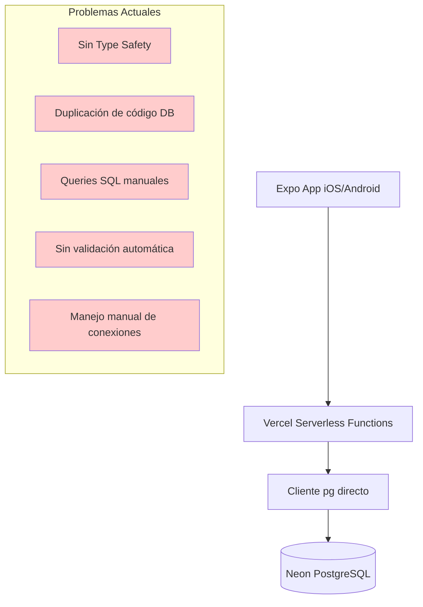
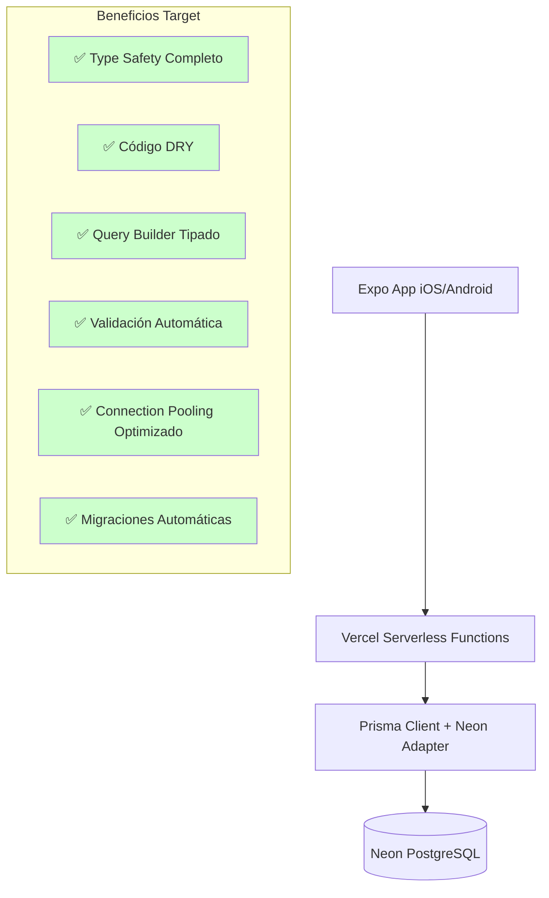
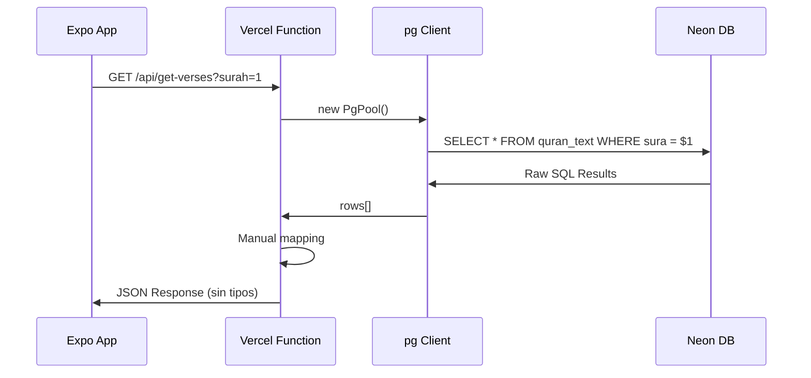
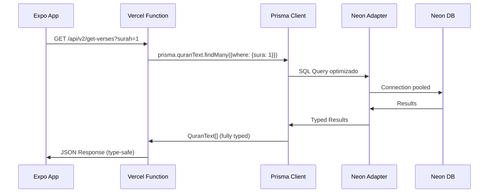
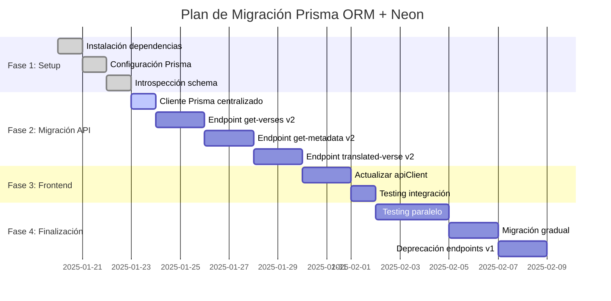

# Plan de Migración: Neon Directo → Prisma ORM + Neon

## Análisis Ejecutivo

**Proyecto:** Luminous Verses (Expo App) - Aplicación Coránica para iOS/Android  
**Objetivo:** Migrar de cliente `pg` directo a Prisma ORM + Neon Serverless Adapter  
**Fecha:** Enero 2025  
**Fundamentación:** Investigación exhaustiva con Perplexity y Context7

---

## 📊 Investigación y Fundamentación

### Convex.dev vs Prisma ORM + Neon vs Neon Directo

| Aspecto | Convex.dev | Prisma ORM + Neon | Neon Directo (Actual) |
|---------|------------|-------------------|----------------------|
| **Type Safety** | ✅ End-to-end completo | ✅ Generación automática | ❌ Sin type safety |
| **Real-time** | ✅ Automático | ⚠️ Manual si necesario | ❌ Sin soporte |
| **Vendor Lock-in** | ❌ Severo | ✅ Bajo riesgo | ✅ Control total |
| **Migración** | ❌ Reescritura completa | ✅ Gradual, bajo riesgo | N/A |
| **Adecuado para Contenido Coránico** | ❌ Overkill | ✅ Perfecto | ⚠️ Funcional pero limitado |
| **Developer Experience** | ✅ Excelente | ✅ Muy bueno | ❌ Manual |
| **Costo** | ⚠️ Potencialmente mayor | ✅ Neutral | ✅ Mínimo |

### Recomendación Final

**✅ Prisma ORM + Neon** es la opción óptima porque:

1. **Migración de Bajo Riesgo**: Mantiene infraestructura Neon existente
2. **Type Safety Crítico**: Para datos religiosos, la precisión es fundamental
3. **No Real-time Necesario**: Contenido Coránico es principalmente estático
4. **Preparación Futura**: Base sólida para funcionalidades como bookmarks, búsqueda
5. **Cost-Effective**: Sin cambios en hosting o infraestructura

---

## 🏗️ Arquitectura Actual vs Target

### Arquitectura Actual


### Arquitectura Target


---

## 🚀 Plan de Implementación

### Fase 1: Preparación y Setup (1-2 días)

#### 1.1 Instalación de Dependencias
```bash
npm install prisma @prisma/client @prisma/adapter-neon
npm install -D prisma
```

#### 1.2 Configuración Inicial
```prisma
// prisma/schema.prisma
generator client {
  provider        = "prisma-client-js"
  previewFeatures = ["driverAdapters"]
}

datasource db {
  provider = "postgresql"
  url      = env("NEON_DATABASE_URL")
}
```

#### 1.3 Introspección del Schema Existente
```bash
npx prisma db pull
npx prisma generate
```

#### 1.4 Schema Target Esperado
```prisma
model QuranText {
  id           Int    @id @default(autoincrement())
  sura         Int
  aya          Int
  text         String
  
  @@map("quran_text")
}

model QuranSurah {
  number             Int    @id
  arabicName         String @map("arabic_name")
  transliteration    String
  englishName        String @map("english_name")
  ayas               Int
  revelationType     String @map("revelation_type")
  chronologicalOrder Int    @map("chronological_order")
  rukus              Int
  
  @@map("quran_surahs")
}

model EnYusufali {
  index Int    @id
  sura  Int
  aya   Int
  text  String
  
  @@map("en_yusufali")
}

model QuranSajda {
  sajdaId     Int @id @map("sajda_id")
  surahNumber Int @map("surah_number")
  ayahNumber  Int @map("ayah_number")
  type        String
  
  @@map("quran_sajdas")
}
```

### Fase 2: Migración de Endpoints (1 semana)

#### 2.1 Crear Cliente Prisma Centralizado
```typescript
// lib/prisma.ts
import { PrismaClient } from '@prisma/client'
import { PrismaNeon } from '@prisma/adapter-neon'

const adapter = new PrismaNeon({ 
  connectionString: process.env.NEON_DATABASE_URL 
})

const globalForPrisma = globalThis as unknown as {
  prisma: PrismaClient | undefined
}

export const prisma = globalForPrisma.prisma ?? 
  new PrismaClient({ adapter })

if (process.env.NODE_ENV !== 'production') {
  globalForPrisma.prisma = prisma
}
```

#### 2.2 Migración por Endpoint

**2.2.1 Nuevo `/api/v2/get-verses.ts`**
```typescript
import type { VercelRequest, VercelResponse } from '@vercel/node'
import { prisma } from '../../lib/prisma'

export default async function handler(req: VercelRequest, res: VercelResponse) {
  if (req.method !== 'GET') {
    return res.status(405).json({ error: 'Method not allowed' })
  }

  const { surah } = req.query
  const surahNumber = parseInt(surah as string)

  if (isNaN(surahNumber) || surahNumber < 1 || surahNumber > 114) {
    return res.status(400).json({ error: 'Invalid surah number' })
  }

  try {
    const verses = await prisma.quranText.findMany({
      where: { sura: surahNumber },
      orderBy: { aya: 'asc' },
      select: {
        id: true,
        sura: true,
        aya: true,
        text: true
      }
    })

    const response = verses.map(verse => ({
      id: verse.id,
      surahId: verse.sura,
      numberInSurah: verse.aya,
      text: verse.text
    }))

    return res.status(200).json(response)
  } catch (error) {
    console.error('Database error:', error)
    return res.status(500).json({ error: 'Database error' })
  }
}
```

**2.2.2 Nuevo `/api/v2/get-metadata.ts`**
```typescript
import type { VercelRequest, VercelResponse } from '@vercel/node'
import { prisma } from '../../lib/prisma'

export default async function handler(req: VercelRequest, res: VercelResponse) {
  const { type } = req.query

  try {
    switch (type) {
      case 'surah-list':
        const surahs = await prisma.quranSurah.findMany({
          orderBy: { number: 'asc' },
          select: {
            number: true,
            arabicName: true,
            transliteration: true,
            englishName: true,
            ayas: true,
            revelationType: true,
            chronologicalOrder: true,
            rukus: true
          }
        })
        return res.status(200).json(surahs.map(s => ({
          number: s.number,
          name: s.arabicName,
          tname: s.transliteration,
          ename: s.englishName,
          ayas: s.ayas,
          type: s.revelationType,
          order: s.chronologicalOrder,
          rukus: s.rukus
        })))
      
      case 'sajdas':
        const sajdas = await prisma.quranSajda.findMany({
          orderBy: [{ surahNumber: 'asc' }, { ayahNumber: 'asc' }]
        })
        return res.status(200).json(sajdas)
      
      default:
        return res.status(400).json({ error: 'Invalid metadata type' })
    }
  } catch (error) {
    console.error('Database error:', error)
    return res.status(500).json({ error: 'Database error' })
  }
}
```

**2.2.3 Nuevo `/api/v2/get-translated-verse.ts`**
```typescript
import type { VercelRequest, VercelResponse } from '@vercel/node'
import { prisma } from '../../lib/prisma'

export default async function handler(req: VercelRequest, res: VercelResponse) {
  const { surah, ayah, translator } = req.query
  
  const surahNum = parseInt(surah as string)
  const ayahNum = parseInt(ayah as string)

  if (isNaN(surahNum) || isNaN(ayahNum) || translator !== 'en.yusufali') {
    return res.status(400).json({ error: 'Invalid parameters' })
  }

  try {
    const [arabicVerse, translation] = await Promise.all([
      prisma.quranText.findFirst({
        where: { sura: surahNum, aya: ayahNum }
      }),
      prisma.enYusufali.findFirst({
        where: { sura: surahNum, aya: ayahNum }
      })
    ])

    if (!arabicVerse && !translation) {
      return res.status(404).json({ error: 'Verse not found' })
    }

    return res.status(200).json({
      id: arabicVerse?.id || translation?.index || 0,
      surahId: surahNum,
      numberInSurah: ayahNum,
      text: arabicVerse?.text || '',
      translation: translation?.text || ''
    })
  } catch (error) {
    console.error('Database error:', error)
    return res.status(500).json({ error: 'Database error' })
  }
}
```

### Fase 3: Actualización del Frontend (2-3 días)

#### 3.1 Actualizar `src/services/apiClient.ts`
```typescript
// Gradualmente cambiar base URLs de /api/ a /api/v2/
const API_BASE_URL = process.env.API_BASE_URL || '/api/v2'

export class ApiClient {
  async getVerses(surahId: number): Promise<Verse[]> {
    // Implementación actualizada para nuevos endpoints
  }
  
  async getMetadata(type: string): Promise<any> {
    // Implementación actualizada
  }
}
```

### Fase 4: Testing y Deprecación (1 semana)

#### 4.1 Testing Paralelo
- Ejecutar ambas versiones en paralelo
- Comparar respuestas `/api/` vs `/api/v2/`
- Validar type safety en desarrollo

#### 4.2 Migración Gradual del Frontend
- Cambiar un endpoint a la vez
- Monitoreo de performance
- Rollback plan preparado

#### 4.3 Deprecación de Endpoints Antiguos
```typescript
// api/get-verses.ts (marcado como deprecated)
export default async function handler(req: VercelRequest, res: VercelResponse) {
  console.warn('[DEPRECATED] Use /api/v2/get-verses instead')
  // Implementación actual...
}
```

---

## 🔄 Flujo de Datos: Antes vs Después

### Flujo Actual


### Flujo Target


---

## 📈 Beneficios Esperados

### Type Safety
```typescript
// Antes (sin tipos)
const verses = await client.query('SELECT * FROM quran_text WHERE sura = $1', [surah])
// verses.rows[0].text - Sin autocompletado, propenso a errores

// Después (completamente tipado)
const verses = await prisma.quranText.findMany({
  where: { sura: surah }
})
// verses[0].text - Autocompletado completo, type checking
```

### Performance
- **Connection Pooling**: Optimizado por Neon Adapter
- **Query Optimization**: Prisma genera SQL optimizado
- **Reduced Boilerplate**: -60% líneas de código

### Mantenibilidad
- **DRY Principle**: Cliente centralizado vs duplicado por endpoint
- **Error Handling**: Unificado y tipado
- **Schema Evolution**: Migraciones automáticas con `prisma migrate`

---

## 🚨 Consideraciones y Riesgos

### Riesgos Mitigados
| Riesgo | Mitigación |
|--------|------------|
| **Breaking Changes** | Implementación en `/api/v2/` primero |
| **Performance Regression** | Testing paralelo y benchmarking |
| **Data Inconsistency** | Misma base de datos, solo capa de acceso cambia |
| **Learning Curve** | Documentación Prisma excelente, sintaxis intuitiva |

### Plan de Rollback
1. Mantener endpoints `/api/` originales hasta validación completa
2. Feature flags para cambiar entre versiones
3. Monitoreo de métricas clave (latencia, errores)

---

## 📅 Timeline Detallado



**Total estimado: 3 semanas**

---

## ✅ Checklist de Implementación

### Fase 1: Preparación
- [ ] Instalar `prisma`, `@prisma/client`, `@prisma/adapter-neon`
- [ ] Crear `prisma/schema.prisma` con configuración básica
- [ ] Ejecutar `npx prisma db pull` para introspección
- [ ] Verificar schema generado vs tablas actuales
- [ ] Ejecutar `npx prisma generate` para generar cliente

### Fase 2: Implementación
- [ ] Crear `lib/prisma.ts` con cliente centralizado
- [ ] Implementar `/api/v2/get-verses.ts` con Prisma
- [ ] Implementar `/api/v2/get-metadata.ts` con Prisma
- [ ] Implementar `/api/v2/get-translated-verse.ts` con Prisma
- [ ] Testing unitario de nuevos endpoints

### Fase 3: Integración
- [ ] Actualizar `src/services/apiClient.ts` para usar v2
- [ ] Crear configuración para cambiar entre v1/v2
- [ ] Testing de integración frontend-backend
- [ ] Verificar type safety en componentes

### Fase 4: Validación
- [ ] Benchmark performance v1 vs v2
- [ ] Testing paralelo con datos reales
- [ ] Verificar compatibilidad con Expo app
- [ ] Plan de rollback preparado
- [ ] Deprecar endpoints v1
- [ ] Actualizar documentación Memory Bank

---

## 🎯 Métricas de Éxito

| Métrica | Actual | Target | Método de Medición |
|---------|--------|--------|-------------------|
| **Type Safety** | 0% | 100% | TSC compilation errors |
| **Code Duplication** | ~200 líneas duplicadas | <50 líneas | Análisis estático |
| **API Response Time** | Baseline | ≤ Baseline + 10% | Benchmarking |
| **Developer Experience** | Manual SQL | Type-safe queries | Tiempo de desarrollo |
| **Error Rate** | Baseline | < Baseline | Monitoring logs |

---

## 📚 Recursos de Referencia

### Documentación
- [Prisma ORM with Neon](https://www.prisma.io/docs/orm/overview/databases/neon)
- [Neon Serverless Adapter](https://www.prisma.io/docs/orm/overview/databases/neon#neon-serverless-driver)
- [Vercel Edge Functions with Prisma](https://www.prisma.io/docs/orm/prisma-client/deployment/edge/deploy-to-vercel)

### Investigación Realizada
- **Perplexity Research**: Análisis completo de Convex.dev vs alternativas
- **Context7 Documentation**: Documentación técnica detallada de Prisma ORM
- **Memory Bank Review**: Comprensión completa del proyecto actual

---

## 🔄 Próximos Pasos

1. **Revisión del Plan**: Validar con el equipo este plan detallado
2. **Aprobación**: Confirmar go/no-go para implementación
3. **Kick-off**: Iniciar Fase 1 con setup de dependencias
4. **Implementación**: Seguir timeline propuesto
5. **Monitoreo**: Tracking continuo de métricas de éxito

---

**Conclusión**: La migración a Prisma ORM + Neon ofrece mejoras significativas en type safety, developer experience y mantenibilidad, con riesgo mínimo gracias a la estrategia de implementación gradual propuesta.