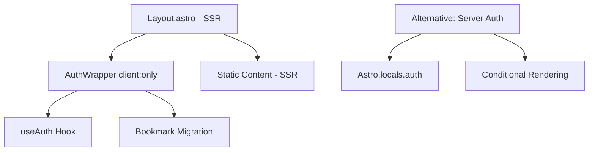

# Plan de Corrección: Error SSR con Clerk Authentication

## 🚨 Problema Identificado

**Error:** `TypeError: Cannot read properties of null (reading 'useContext')`

**Causa Raíz:** El componente `AuthInitializer` está usando `useAuth()` de `@clerk/clerk-react` durante el server-side rendering (SSR), pero los hooks de React no pueden ejecutarse en el servidor sin el contexto adecuado.

**Ubicación del Error:**
- `apps/quranexpo-web/src/components/AuthInitializer.tsx` (usa `useAuth()`)
- `apps/quranexpo-web/src/hooks/useAuthAndBookmarkMigration.ts` (usa `useAuth()`)
- `apps/quranexpo-web/src/layouts/Layout.astro` (renderiza `AuthInitializer` en SSR)

## 🎯 Solución Estratégica

### Principios Clave
1. **Separación SSR vs Cliente:** Los hooks de Clerk solo funcionan en el cliente
2. **Client-Only Components:** Usar `client:only="react"` para componentes con hooks
3. **Migración Progresiva:** Mantener funcionalidad existente mientras se corrige

### Arquitectura de Solución



## 📋 Plan de Implementación

### Fase 1: Corrección Inmediata (30 minutos)

#### Opción A: Client-Only Component (Recomendado)

**1.1. Crear AuthClientWrapper.tsx**
```tsx
// apps/quranexpo-web/src/components/AuthClientWrapper.tsx
import { useAuthAndBookmarkMigration } from '../hooks/useAuthAndBookmarkMigration';

interface AuthClientWrapperProps {
  children: preact.ComponentChildren;
}

export default function AuthClientWrapper({ children }: AuthClientWrapperProps) {
  // Este hook ahora solo se ejecuta en el cliente
  useAuthAndBookmarkMigration();
  
  return <>{children}</>;
}
```

**1.2. Actualizar Layout.astro**
```astro
---
import AuthClientWrapper from '../components/AuthClientWrapper.tsx';
import Background from '../components/Background.tsx';
import '../styles/global.css';

interface Props {
  title: string;
}

const { title } = Astro.props;
---

<!doctype html>
<html lang="en">
  <head>
    <meta charset="UTF-8" />
    <meta name="viewport" content="width=device-width" />
    <link rel="icon" type="image/svg+xml" href="/favicon.svg" />
    <meta name="generator" content={Astro.generator} />
    <title>{title}</title>
  </head>
  <body>
    <Background />
    <!-- Solo se ejecuta en el cliente -->
    <AuthClientWrapper client:only="react">
      <slot />
    </AuthClientWrapper>
  </body>
</html>
```

**1.3. Eliminar AuthInitializer.tsx**
```bash
rm apps/quranexpo-web/src/components/AuthInitializer.tsx
```

#### Opción B: Conditional Client Loading

**1.1. Actualizar Layout.astro con Conditional Loading**
```astro
---
import AuthInitializer from '../components/AuthInitializer.tsx';
import Background from '../components/Background.tsx';
import '../styles/global.css';

interface Props {
  title: string;
}

const { title } = Astro.props;
---

<!doctype html>
<html lang="en">
  <head>
    <meta charset="UTF-8" />
    <meta name="viewport" content="width=device-width" />
    <link rel="icon" type="image/svg+xml" href="/favicon.svg" />
    <meta name="generator" content={Astro.generator} />
    <title>{title}</title>
  </head>
  <body>
    <Background />
    <!-- Cargar solo en el cliente -->
    <AuthInitializer client:load>
      <slot />
    </AuthInitializer>
  </body>
</html>
```

### Fase 2: Optimización (1-2 horas)

#### 2.1. Mejorar Hook de Migración

**Actualizar useAuthAndBookmarkMigration.ts**
```typescript
import { useAuth } from '@clerk/clerk-react';
import { useEffect, useRef, useState } from 'preact/hooks';
import { migrateBookmarksToDatabase } from '../services/bookmarkMigrationService';

export function useAuthAndBookmarkMigration() {
  const { userId, isLoaded, isSignedIn } = useAuth();
  const hasMigrated = useRef(false);
  const [migrationStatus, setMigrationStatus] = useState<'idle' | 'migrating' | 'success' | 'error'>('idle');

  useEffect(() => {
    // Solo ejecutar si Clerk está cargado y el usuario está autenticado
    if (!isLoaded) return;
    
    if (isSignedIn && userId && !hasMigrated.current) {
      setMigrationStatus('migrating');
      console.log('User is signed in, attempting bookmark migration...');
      
      migrateBookmarksToDatabase(userId)
        .then(() => {
          hasMigrated.current = true;
          setMigrationStatus('success');
          console.log('Bookmark migration completed successfully.');
        })
        .catch(error => {
          setMigrationStatus('error');
          console.error('Error during bookmark migration:', error);
        });
    } else if (isLoaded && !isSignedIn) {
      // Reset migration status if user signs out
      hasMigrated.current = false;
      setMigrationStatus('idle');
      console.log('User signed out, resetting migration status.');
    }
  }, [isLoaded, isSignedIn, userId]);

  return { migrationStatus };
}
```

#### 2.2. Crear Componente de Estado de Migración

**Crear MigrationStatusIndicator.tsx**
```tsx
// apps/quranexpo-web/src/components/MigrationStatusIndicator.tsx
import { useAuthAndBookmarkMigration } from '../hooks/useAuthAndBookmarkMigration';

export default function MigrationStatusIndicator() {
  const { migrationStatus } = useAuthAndBookmarkMigration();

  if (migrationStatus === 'migrating') {
    return (
      <div className="fixed top-4 right-4 bg-blue-500 text-white px-4 py-2 rounded-lg shadow-lg">
        Sincronizando bookmarks...
      </div>
    );
  }

  if (migrationStatus === 'error') {
    return (
      <div className="fixed top-4 right-4 bg-red-500 text-white px-4 py-2 rounded-lg shadow-lg">
        Error al sincronizar bookmarks
      </div>
    );
  }

  return null;
}
```

#### 2.3. Actualizar AuthClientWrapper

```tsx
// apps/quranexpo-web/src/components/AuthClientWrapper.tsx
import { useAuthAndBookmarkMigration } from '../hooks/useAuthAndBookmarkMigration';
import MigrationStatusIndicator from './MigrationStatusIndicator';

interface AuthClientWrapperProps {
  children: preact.ComponentChildren;
}

export default function AuthClientWrapper({ children }: AuthClientWrapperProps) {
  useAuthAndBookmarkMigration();
  
  return (
    <>
      <MigrationStatusIndicator />
      {children}
    </>
  );
}
```

### Fase 3: Alternativa Server-Side (Opcional)

#### 3.1. Usar Astro.locals.auth() para Server-Side

**Crear middleware de migración**
```typescript
// apps/quranexpo-web/src/middleware/authMigration.ts
import type { MiddlewareResponseHandler } from 'astro';

export const onRequest: MiddlewareResponseHandler = async (context, next) => {
  const { userId } = context.locals.auth();
  
  if (userId) {
    // Marcar que el usuario está autenticado para el cliente
    context.locals.isAuthenticated = true;
    context.locals.userId = userId;
  }
  
  return next();
};
```

## 🧪 Testing del Fix

### Test 1: Verificar que no hay errores SSR
```bash
cd apps/quranexpo-web
npm run build
npm run preview
```

### Test 2: Verificar migración en cliente
1. Abrir DevTools
2. Ir a `/settings`
3. Verificar que no hay errores en consola
4. Verificar que la migración se ejecuta al hacer login

### Test 3: Verificar funcionalidad de bookmarks
1. Hacer login
2. Agregar bookmarks
3. Verificar que se guardan en la API
4. Hacer logout/login
5. Verificar que los bookmarks persisten

## 📊 Métricas de Éxito

- ✅ **Error SSR eliminado:** No más errores de `useContext`
- ✅ **Migración funcional:** Los bookmarks se migran correctamente
- ✅ **UX mantenida:** La experiencia de usuario no se degrada
- ✅ **Performance:** No impacto negativo en tiempo de carga

## 🔧 Comandos de Implementación

```bash
# 1. Crear el nuevo componente
touch apps/quranexpo-web/src/components/AuthClientWrapper.tsx

# 2. Actualizar Layout.astro
# (editar manualmente)

# 3. Eliminar AuthInitializer.tsx
rm apps/quranexpo-web/src/components/AuthInitializer.tsx

# 4. Probar la aplicación
cd apps/quranexpo-web
npm run dev
```

## 🚨 Consideraciones Importantes

### Ventajas de la Solución
- **Corrección inmediata:** Elimina el error SSR
- **Mantiene funcionalidad:** La migración sigue funcionando
- **Mejora UX:** Añade indicadores de estado
- **Escalable:** Fácil de extender con más funcionalidades

### Limitaciones
- **Client-only:** La migración solo ocurre en el cliente
- **Dependencia de JS:** Requiere JavaScript habilitado
- **Timing:** La migración ocurre después de la hidratación

### Alternativas Consideradas
1. **Server-side migration:** Más complejo, requiere cambios en middleware
2. **Lazy loading:** Cargar migración bajo demanda
3. **Service Worker:** Migración en background

## 📝 Próximos Pasos

1. **Implementar Opción A** (recomendado)
2. **Probar en desarrollo**
3. **Verificar en producción**
4. **Monitorear errores**
5. **Optimizar según feedback**

## 🔗 Referencias

- [Clerk Astro Documentation](https://clerk.com/docs/references/astro)
- [Astro Client Directives](https://docs.astro.build/en/reference/directives-reference/#client-directives)
- [Astro SSR Guide](https://docs.astro.build/en/guides/server-side-rendering/)